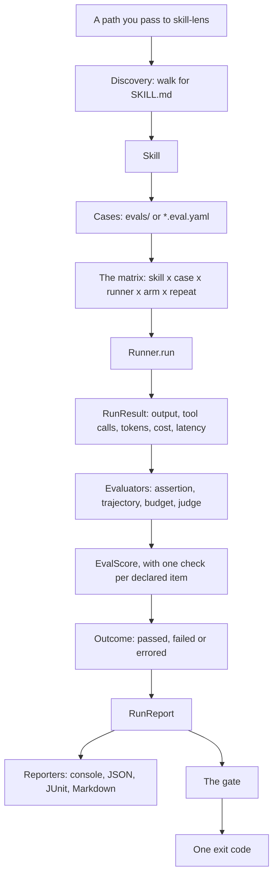
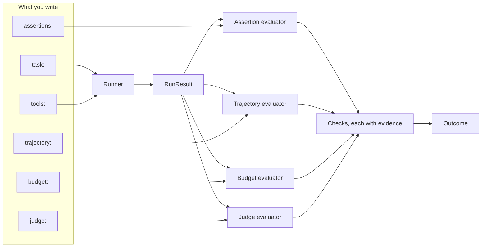

# Concepts

`skill-lens` has a small vocabulary, and every other page assumes it. This page defines each
term once, in the order the tool uses them, so it reads as one story from a directory on disk
to an exit code. Each section ends with a link to the page that covers it in full. The
[Glossary](#glossary) at the end is the same vocabulary arranged for lookup.

## The pipeline

One run, from a directory of skills to a single exit code.



## Skill

A skill is a directory containing a `SKILL.md` file: instructions an agent loads to do one
kind of task. The file opens with YAML frontmatter, and the instructions are the body below
it.

```markdown
---
name: greeting
description: Greet a user warmly and by name
version: 1.1.0
---

When greeting someone, address them by name and keep it to one short sentence.
```

`name` identifies the skill in every report, and falls back to the directory name when the
frontmatter omits it. `description` is what an agent reads when deciding whether to reach for
the skill. `version` is optional; when it is declared, `--baseline previous` uses it to
identify the prior version.

Three directories may sit beside `SKILL.md` — `scripts/`, `references/` and `assets/`.
Together they are the skill's **bundle**, and a case can let the agent read them. See
[Bundled files and scripts](runners.md#bundled-files-and-scripts).

## Eval case

A case is one task plus what you expect of it, written in YAML beside the skill.

```yaml
cases:
  - name: never leaks a stack trace
    task: I want a refund for order 1234
    tags: [smoke]
    assertions:
      - kind: not_contains
        value: Traceback
```

`skill-lens` looks for cases in an `evals/` directory beside `SKILL.md`, or in any
`*.eval.yaml` file beside it. A skill with neither is reported as **skipped** — visible in the
output, never silently ignored. `tags:` labels a case so `--tag smoke` can select it, and
`--case "stack trace"` selects one by name.

Only `name` and `task` are required, so a case that declares no scoring at all passes. That is
why `skill-lens init` writes `TODO(skill-lens)` into every value you must supply, and refuses
to run a case that still holds one.

See [Eval files](eval-files.md).

## A case, end to end

What happens to one case, from its task to its verdict.



## Task and mode

The **task** is the prompt handed to the agent, verbatim. The **mode** decides whether the
agent is given the skill at all.

- `loaded`, the default, puts the skill's instructions in force and measures what the agent
  does with them.
- `offered` does not. The skill is registered as a tool, named after it and described by its
  frontmatter `description`. If the agent calls that tool it receives the instructions; if it
  does not, it never sees them. Triggering becomes a real choice, and an observable one.

```yaml
  - name: leaves an unrelated question alone
    mode: offered
    task: What's the capital of Egypt?
    trajectory:
      skill_triggered: false
```

Always ship a negative control like that one. A suite of positives alone scores a skill that
fires on everything at 100%.

See [Did the agent reach for the skill?](eval-files.md#did-the-agent-reach-for-the-skill)

## Runner

The runner is the thing that actually runs a case and hands back a result: the output text,
the tool calls it made, the tokens it spent, the time it took. Three kinds ship.

| Kind | Names | Needs |
| --- | --- | --- |
| Fake | `fake` (the default) | nothing — scripted, offline, free |
| Framework | `pydantic-ai`, `langchain` | the matching install extra, and an API key in the environment |
| Product | `copilot`, `claude-code`, `cli` | the product installed; it uses its own auth, so no API key |

```bash
skill-lens run ./skills --runner pydantic-ai --model openai:gpt-4o-mini
```

`fake` answers every task with a canned string and calls no tool, so it exercises the whole
pipeline at no cost — validate a suite with it before spending anything. `--runner` is
repeatable: name two and every case runs through each, with one outcome per
`(skill, case, runner)`.

See [Runners](runners.md).

## Mock tools

A mock tool is a tool the agent may call whose answer you write yourself. Nothing executes:
calling one records the call and returns `returns` verbatim. So a case has no side effects,
costs nothing to serve, and the tools the agent reached for are genuinely its own choice.

```yaml
    tools:
      - name: lookup_order
        description: Look up an order by its id
        parameters:
          order_id: string
        returns: '{"id": "1234", "status": "delivered", "days_since_delivery": 45}'
```

`returns:` can also be a list — answering each call in turn, or branching on the arguments the
call carried — so one case can exercise a skill that loops or decides. A **tool library** is a
YAML file with one top-level `tools:` list; several eval files import it with
`tool_libraries:` and name a tool with `- ref:` rather than repeating the block.

See [Mock tools](eval-files.md#mock-tools).

## Workspace

A `workspace:` block gives one case a real temporary directory: created fresh, seeded with the
files the case declares, and deleted once the case is scored. The agent gets three more tools
with it — `list_files`, `read_file` and `write_file` — and they are the only way in or out. A
path that resolves outside the directory is refused before it touches the filesystem.

```yaml
  - name: writes a regional summary
    task: Read sales.csv and write report.md
    workspace:
      files:
        sales.csv: |
          region,units
          north,120
    assertions:
      - kind: file-produced
        file: report.md
```

That is how a case scores the file a skill produced rather than the chat message about it. It
is opt-in: a case with no `workspace:` block gets no directory and no extra tools.

See [The workspace](runners.md#the-workspace).

## Evaluator

An evaluator scores a result. Four ship, and one case may declare any combination of them.

| Block | Scores | Checks it can declare |
| --- | --- | --- |
| `assertions` | the output text, or a workspace file | `contains`, `not_contains`, `regex`, `equals`, `file-produced`, `json-schema` |
| `trajectory` | which tools ran, in what order, how often, with what arguments | `called`, `forbidden`, `order`, `max_calls`, `call_args`, `skill_triggered` |
| `budget` | what the run cost | `max_tokens`, `max_cost_usd`, `max_latency_ms` |
| `judge` | output quality, against a rubric you write | one check per `rubric:` line |

Every check a case declares must hold for the case to pass. The first three are deterministic
and free. The judge is a large language model (LLM) grading text, so it costs money and is
turned on deliberately with the `judge` key in `skill-lens.toml`. The default,
`judge = "fake"`, grades nothing and reports a case carrying a rubric as **errored**, rather
than passing a rubric nobody checked.

See [Eval files](eval-files.md).

## Check, evidence and score

An evaluator does not return one verdict for a whole block. It returns one result per declared
item: a stable id, pass or fail, and the **evidence** behind that verdict. The id is derived
from what the case declared and never from what the run produced — `contains[0]`,
`called:lookup_order`, `max_tokens` — so the same id names the same check in both arms of a
comparison.

```
[FAIL] refund :: refuses a refund outside the return window (fake)
        trajectory: lookup_order was never called
            called:lookup_order: lookup_order was never called
```

The **score** is the fraction of an evaluator's checks that held; passing needs all of them,
so a score of 0.75 is still a failure. The console prints evidence only for checks that
failed, to keep a green run short; the JSON report carries every check's id and evidence
either way. For the judge, evidence is load-bearing: a check that passes without citing any is
recorded as a **failure**, because an unsupported PASS is an LLM judge's characteristic
failure mode.

See [Per-check results](eval-files.md#per-check-results).

## Outcome: passed, failed, errored

Every case ends in exactly one of three states, and the difference between the last two is the
most important distinction in the tool.

- **passed** — the case ran and every check it declared held.
- **failed** — the case ran and scored below the bar. This is a signal about *the skill*.
- **errored** — the harness itself blew up: the provider returned a 500, the API key was
  missing, the product exited non-zero, the judge's reply held no readable verdict. This is a
  signal about *the infrastructure*.

Conflating them would make a broken API key look like a badly written skill. An errored case
fails the gate by default, so continuous integration never goes green on a run that did not
actually happen.

```
[PASS] refund :: never leaks a stack trace (fake)
[FAIL] refund :: refuses a refund outside the return window (fake)
        trajectory: lookup_order was never called
```

See [Gating and exit codes](gating.md).

## Arm, baseline and delta

Every case can run twice, once in each **arm**. The **candidate** arm is the skill exactly as
it is now. The **baseline** arm is the comparison point, chosen with `--baseline`:

- `none` — an empty skill: the same name, no description, no instructions. It isolates what
  the skill's text contributes, as opposed to what the model would have answered unprompted.
- `previous` — the prior version, resolved from the skill's own git history. It isolates what
  one edit changed.

The **delta** is the difference, always candidate minus baseline:

```
Delta vs baseline (previous)
  pass rate  40% -> 100%  +60%   (higher is better)
  tokens     -60   (negative is better)
```

Only the candidate arm feeds the gate: a strong baseline means the skill was unnecessary, not
that the build should go red. Omitting `--baseline` is what turns comparison off — `none` is a
kind of baseline, not the absence of one.

See [Comparative evals](comparative-evals.md).

## Gate and exit codes

The gate turns the whole run into one number a pipeline can act on.

| Code | Meaning |
| --- | --- |
| `0` | The gate passed |
| `1` | The gate failed — the pass rate was below `min_pass_rate`, a per-skill minimum was missed, or some case errored |
| `2` | Something in your own files or flags is wrong: a bad path, malformed YAML, an unknown assertion kind, an unfilled `TODO(skill-lens)` |

Exit `2` is deliberately not a gate failure. A mistake in your files says nothing about the
skill, so it aborts the run rather than scoring as evidence against it.

**A run that executed zero cases fails as well.** "Nothing ran" is a broken run, not a pass —
otherwise a mistyped path would report success forever. The reason names the cause: no skills
found, every skill skipped for having no cases, or every case filtered out by `--tag` or
`--case`.

See [Gating and exit codes](gating.md).

## Glossary

| Term | Meaning |
| --- | --- |
| Agent Skill | A directory holding a `SKILL.md` file: instructions an agent loads to do one kind of task. |
| Arm | One side of a comparison run — `candidate` (the skill as it is now) or `baseline`. |
| Assertion | A rule checked against the agent's final output text, such as `contains` or `regex`. |
| Baseline | What the candidate is measured against: an empty skill (`none`) or the previous version (`previous`). |
| Budget | A limit on tokens, cost or latency that a case declares and the run checks. |
| Bundle | The `scripts/`, `references/` and `assets/` directories beside a `SKILL.md`. |
| Candidate | The arm running the skill under test. The only arm the gate reads. |
| Case | One task plus what you expect of it, written in YAML beside the skill. |
| Cassette | A recorded provider response replayed in tests, so the suite runs offline. |
| Check | One pass-or-fail verdict with its evidence, emitted by an evaluator. |
| Delta | The measured difference between the candidate and baseline arms. |
| Errored | The harness blew up. An infrastructure signal, not a verdict on the skill. |
| Evaluator | Something that scores a run result. Four ship: assertion, trajectory, budget, judge. |
| Failed | The case ran and scored below the bar. A signal about the skill. |
| Gate | The rule that turns a whole run into one exit code. |
| Judge | A model that grades output quality against a rubric you write, check by check. |
| `loaded` / `offered` | Whether the agent is handed the skill, or left to reach for it. |
| Mock tool | A tool whose answer you write yourself, so a case is deterministic and free. |
| Outcome | The result of one (skill, case, runner, arm, repetition): passed, failed or errored. |
| Preflight | Checks run once before any case, so a run refuses what it cannot serve before spending. |
| Product runner | An installed agent product — GitHub Copilot CLI, Claude Code — driven as the runner. |
| Rubric | The list of `judge:` checks a judge grades the output against. |
| Runner | The thing that actually runs a case and returns a result. |
| Skill | Short for Agent Skill: the directory under test. |
| Tool library | A YAML file of mock tools, imported by several eval files with `tool_libraries:`. |
| Trajectory | Which tools were called, in what order, how many times, and with what arguments. |
| Workspace | The temporary directory a case gets, so it can produce and check real files. |
