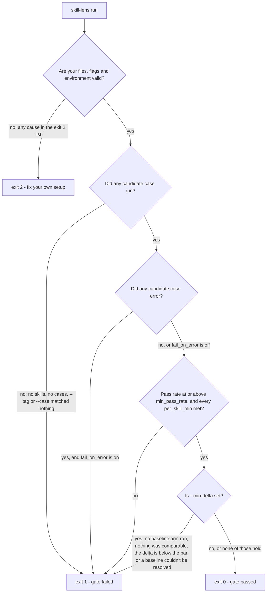

# Gating and exit codes

Exit codes are the CI contract. This page is where they are defined; every other page
summarises them and links here.

| Code | Meaning |
| --- | --- |
| `0` | Gate passed |
| `1` | Gate failed — including a run in which [no case ran at all](troubleshooting.md#no-eval-cases-ran) |
| `2` | User or authoring error — something in your files, flags or environment is wrong, so nothing was measured. [Every cause is listed below](#exit-2-user-and-authoring-errors). |



## Exit 2: user and authoring errors

Exit `2` is deliberately not a gate failure. A mistake in your setup says nothing about the
skill, so the run stops instead of scoring it as evidence against the skill (see
[Authoring errors abort the run; they never score as failures](invariants.md#authoring-errors-abort-the-run-they-never-score-as-failures)).
Every cause below is found **before any case runs**, so it spends no money — except two. A
malformed regex is found when its assertion runs, so earlier cases may already have spent
money. A report that cannot be written is found after the run.

This list is complete. It follows `_AUTHORING_ERRORS` and the `typer.BadParameter` checks in
`src/skill_lens/cli.py`; a new exit-2 cause is added here, and only here.

**A flag, or a flag combination, that cannot work.**

- An unknown `--runner`, or the same runner named twice (on the flag or in
  `default_runner`); an unknown `--baseline`; an unknown `judge` in `skill-lens.toml`.
- `--repeat`, `--concurrency` or `--markdown-max-chars` below `1`, or
  `--markdown-max-chars` without `--markdown-output`.
- `--min-delta` without `--baseline` (see [below](#gating-on-the-delta-min-delta)).
- A `--model` or `--judge-model` that resolves to blank, or an invalid `--base-url`.
- A `--model`, `--base-url` or `--judge-model` that nothing in the run reads (see
  [CLI](cli.md#run)).

**A `skill-lens.toml` that cannot be used** (`ConfigError`): a `--config` path that does not
exist, invalid TOML, an unknown key, an invalid value (such as a `base_url` holding a
credential, or an empty `default_runner`), or a `cli` runner or judge with no
`[runners.cli] command`. See [Configuration](configuration.md).

**A skill that cannot be read** (`SkillParseError`): a path that does not exist, an
unreadable `SKILL.md`, malformed frontmatter, or a `version:` that YAML does not read as text
(see [the invariant](invariants.md#a-version-that-yaml-does-not-parse-as-a-string-is-an-authoring-error)).

**An eval file that cannot be used** (`CaseParseError`), including a tool library it
imports: malformed YAML, an unknown key, an unknown assertion `kind:`, a leftover
`TODO(skill-lens)`, `file:` or
`judge.artifacts` without a `workspace:` block, a rubric entry phrased against a mock
tool's `returns:`, an invalid `input_schema`, a `when:` entry that could never answer a
call, or a `ref:` that cannot be resolved. See [Eval files](eval-files.md).

**An assertion that cannot be checked** (`InvalidAssertionValue`): a malformed regex. It is
found when the assertion runs, not when the file loads, so `skill-lens list` does not catch
it. (`UnknownAssertionKind` is the same check for a case built in code, which skips the
loader.)

**A runner or judge that cannot run here**, found in preflight (the checks made after
loading and before the first case):

- A keyed runner or judge whose provider key is not exported (`MissingAPIKey`).
- A runner whose optional dependency is not installed (`RunnerDependencyError`).
- A `trajectory:` naming a tool the case does not declare under `fake`, `pydantic-ai` or
  `langchain` (`UndeclaredTool`; a product's tool names are not checked — see
  [Declaring tools](runners.md#declaring-tools-and-scoring-the-trajectory)).
- A `base_url` for a provider that takes no endpoint (`UnsupportedBaseURL`).
- A [product runner](runners.md#product-runners) or
  [product judge](runners.md#judging-with-a-product) that cannot run here
  (`ProductSetupError`): its executable not on `PATH`, a preset's `--version` failing, a
  skill name that cannot be a directory name, a case with `tools:` under a product that
  cannot take the [MCP bridge](runners.md#mock-tools-under-a-product), `trajectory:` or
  `mode: offered` under `cli`, the bridge failing its start-up check, `--available-tools`
  in `[runners.copilot]` while a case declares `tools:`, or a tool-selection flag in a
  product judge's `args`.

**Bundled scripts turned on but unable to run** (`ScriptSetupError`): a script's
interpreter is not on `PATH`, or `script_sandbox = "required"` and no sandbox backend works.
See [Security](security.md).

**A report that cannot be written.** A `--json-output`, `--junit-output` or
`--markdown-output` file that cannot be written exits `2` — but only when the gate itself
passed. A failing gate stays `1`, so a write problem never hides a red run.

The other commands use the same code for the same kind of problem: `list` exits `2` on a
skill or eval file that cannot be read, `init` on a file it cannot read or write, and
`mcp-import` on a listing it cannot read or parse.

When a message on your screen is not explained here, [Troubleshooting](troubleshooting.md)
is keyed by the exact text a run prints — search it for the words you see.

A run fails the gate when the overall pass rate is below `min_pass_rate`, when a configured
per-skill minimum is not met, or when any case **errored**. Two distinctions matter:

- **failed** — the case ran and scored below the bar. An *eval* signal.
- **errored** — something in the harness blew up rather than the skill scoring badly: the
  runner (API error, timeout; a product that exited non-zero, timed out, or
  reported its own failure), or an evaluator (a judge endpoint returning 500,
  a judge verdict that does not match its rubric, a product judge whose reply holds no
  readable verdict, an offered case on a runner that does not support the mode). An *infra*
  signal, and it fails the gate by default so CI never goes green on a broken run.

A case that fails its assertions drags the pass rate below the bar and fails the gate:

```
[FAIL] badskill :: expects something absent (fake)
        assertion: failed: contains('NEVER_PRESENT'): did not hold

0 passed, 1 failed, 0 errored — pass rate 0%

Gate FAILED:
  - pass rate 0% is below the required 100%
```

**A run that executed zero cases also fails.** "Nothing ran" is a broken run, not a pass —
otherwise a mistyped path reports success forever. The reason names the cause: no skills found,
all skills skipped for having no eval cases, every case filtered out by `--tag`, or no case name
matching `--case`.

```
Skipped (no eval cases): badskill

0 passed, 0 failed, 0 errored — pass rate 0%

Gate FAILED:
  - no eval cases ran: all discovered skill(s) were skipped for having no eval cases: badskill
```

**Every gate rule above reads the candidate arm only.** Under `--baseline`, a run also
produces baseline outcomes, but `min_pass_rate`, `per_skill_min`, `fail_on_error` and the
zero-cases check never see them — a strong baseline means the skill was unnecessary, not that
CI should go red. With no baseline, candidate and baseline are the same (empty) set, so none
of these numbers move from what they were before comparative evals existed.

## More than one runner

When a run names several runners, every candidate `(skill, case, runner)` outcome counts
toward the pass rate: a case that fails under one framework fails the gate, whatever it
did under the other. `per_skill_min` is per skill across runners, and `--min-delta` is
measured over the whole matrix. There is no per-runner threshold.

## Gating on the delta (`--min-delta`)

`--min-delta <float>` adds four more gate rules, all evaluated against the
[delta](comparative-evals.md#the-delta-block) between the candidate and baseline arms:

- **no baseline arm ran at all** — every case's baseline was skipped (for example, an
  all-`offered` suite under `--baseline none`), so there is nothing to build a delta from in
  the first place;
- **no case was comparable** — a delta gate that verified nothing must never report a pass,
  the same principle that fails a run executing zero cases;
- the pass-rate delta is below `min_delta`;
- a skill's baseline **could not be resolved** — named, with the reason — because treating an
  unresolvable baseline as "no change" would let a repository pass this gate forever by
  deleting its git history.

`--min-delta` requires `--baseline`; passing one without the other is a user/authoring error
(exit `2`), not a gate failure, since the configuration is rejected before any case runs. A
deliberately skipped baseline (an `offered` case under `--baseline none`) is not, on its own,
a gate reason — nothing went wrong there. But that is only true for *some* cases skipping
their baseline: if *every* case's baseline is skipped this way, there is no baseline arm left
to compare against, and the first rule above fires instead. See
[Comparative evals](comparative-evals.md#-min-delta) for the full picture, including how the
delta is paired and what makes a case comparable.

**Low-signal checks and high-variance cases are advisory.** They are printed alongside a
comparative run's output to point at weak spots in the eval suite, but they never affect the
exit code — see
[Low-signal checks and high-variance cases](comparative-evals.md#low-signal-checks-and-high-variance-cases).

## What a failing case shows

A case that did not pass shows *why* in every reporter: each failing evaluator's detail and
each failing judge check's evidence, and then what the agent actually did — its output and
every tool call, in order.

```
[FAIL] order-support :: refuses a refund outside the return window (pydantic-ai)
        assertion: failed: contains('1234'): did not hold
            contains[0]: contains('1234') did not hold
        output: I'm sorry, but that order was delivered 45 days ago, so it is
        outside our 30-day return window and I can't refund it.
        tool calls:
            lookup_order(order_id="1234")
```

The output is cut at 500 characters. A cut is never silent — the line `… (1,842 more
characters; --full-output prints them)` states exactly how much was removed — and an empty
output prints `output: (empty)`, because "the agent said nothing" is the single most useful
fact about a failed assertion. Tool-call argument values are cut at 80 characters and the
list at 20 calls, with a `… +N more calls` count. `--full-output` (or `full_output = true` in
[`skill-lens.toml`](configuration.md)) lifts the output cap.

Only **non-passing candidate** outcomes are expanded. Passing cases stay one line, and
baseline outcomes are never expanded — they are not the verdict; the delta block is. The
Markdown report renders the same excerpt in fenced blocks inside its failures section, and
the JUnit report appends it to the `<failure>` or `<error>` body. All three read one shared
excerpt, so they can never disagree on what was shown.

## JSON report

`--json-output report.json` writes a machine-readable report alongside the console output:
a `summary` block (counts, overall and per-skill pass rates, token/cost/latency totals),
`skipped_skills`, `tag_filtered_skills`, `case_filtered_skills`, a per-case `outcomes` list,
a top-level `delta` block, `baseline_notes`, `scripts` (`null` when script execution was
off, else `{sandbox, detail, hardening}` saying which OS sandbox the run's scripts ran under
and why — `sandbox` is `"sandbox-exec"`, `"bwrap"` or `"none"` — and whether the harness
could hide its own environment from same-user processes: `hardening` is a short note on
Linux when `prctl(PR_SET_DUMPABLE, 0)` applied, else `null`), `script_notes` (skills that bundle
scripts which did not run because execution was off, each as `{skill_name, script_count}`),
`products` (one entry per product the run executed, as a runner or as the judge — a product
serving as both is listed once — each as `{name, executable, version, trust}`; `trust` is
the fixed sentence about permission prompts and the missing sandbox, the same one the
console prints, describing the product's runner trust whichever seat it filled — a
judge-only product delivers no skill, so it has no bundle for that sentence's reachable-
scripts clause to reach; empty when no product ran), and the `gate` decision with its
reasons.

Comparative evals changed this document additively, not by rewriting what was already there:
every field that existed before them still means what it meant, and the comparison adds
fields alongside them — `arm` and `repeat_index` on each outcome, `baseline_errored` in
`summary`, and the top-level `delta` (`null` when no baseline arm ran) and `baseline_notes`.
A tool that reads only the older fields keeps working unmodified.

Each entry in `outcomes` carries `arm` (`"candidate"` or `"baseline"`) and `repeat_index`
(0-based), so a comparative run's raw per-repetition results can be reconstructed from the
JSON even though the console collapses them to one line per case.

`outcomes[].workspace` is that case's temporary directory path when
[`--keep-workspace`](cli.md) kept it, `null` otherwise — including for every case that
declared no `workspace:` block at all. It is never a path to a directory that has already
been deleted: the field is cleared at the same moment the directory is, so it can never be
a stale pointer in the report.

`outcomes[].cost_note` and `outcomes[].usage_note` say why `cost_usd` or a token count is
`0` rather than measured — an unpriced model, a product that bills per request rather than
per token, or a trace that reported no usage — each empty string when the figure beside it
is a real measurement.

`delta` is the full comparison object — pass-rate, token, cost and latency deltas, per-case
stats, low-signal checks, high-variance cases and notes — and is `null` when no baseline arm
ran. `baseline_notes` lists why a skill's or case's baseline was skipped or unavailable.
`summary.baseline_errored` counts errored baseline repetitions apart from `summary.errored`,
which is candidate-only, for the same reason the gate itself only reads the candidate arm
(above): an errored baseline invalidates that case's delta, it does not mean the skill broke.

`summary`'s token, cost and latency totals sum **both** arms — money spent is money spent —
while `summary.passed` / `summary.failed` / `summary.errored` / `summary.pass_rate` stay
candidate-only, because those are what the gate reads.

## JUnit XML

`--junit-output` writes a JUnit report, the format GitHub, GitLab, Jenkins, CircleCI and
Buildkite all ingest natively.

| skill-lens | JUnit |
| --- | --- |
| `passed` | `<testcase>` with no child |
| `failed` | `<testcase>` with `<failure>` |
| `errored` | `<testcase>` with `<error>` |
| a skill with no cases | `<testcase>` with `<skipped>` |

The `failed`/`errored` split is the same one the exit code and the JSON report use: a
`<failure>` means the case ran and scored below bar, an `<error>` means the runner or an
evaluator blew up.

Only the **candidate** arm becomes test cases. Under `--baseline`, a failing baseline is the
evidence that the skill helped, so rendering it as a `<failure>` would turn CI red for the
skill working.

A run with no eval cases emits a single `<testcase>` carrying an `<error>` that repeats the
gate's reasons. An empty `tests="0"` file renders green in most CI UIs, which would contradict
the exit code of 1.

When scripts were enabled, every `<testsuite>` — a skill that ran, a skipped or filtered
skill, and the synthetic zero-case error suite alike — carries `<properties>` as its first
child, with `skill-lens.scripts.sandbox` and `skill-lens.scripts.detail`: properties are
where JUnit puts run-level facts, and a testcase is the wrong place for something true of
the whole run. The console and Markdown reports print the same fact as one line (`scripts: on,
sandbox: <backend>` on the console, with the probe's detail in parentheses when the backend
is `none`, and `; <hardening note>` appended when the harness could hide its own
environment — see [Runners](runners.md#running-bundled-scripts)) and name every skill whose
bundled scripts did not run because execution was off.

When a product ran — as a runner or as the judge — the same `<properties>` element carries
`skill-lens.products` on every suite: one value naming each product, its version, its
executable and its trust sentence, joined with `; `. The console prints the same fact as one
`product <name> <version> (<executable>): <trust>` line per product, and the Markdown
summary as a footnote; see [Runners](runners.md#product-runners).
