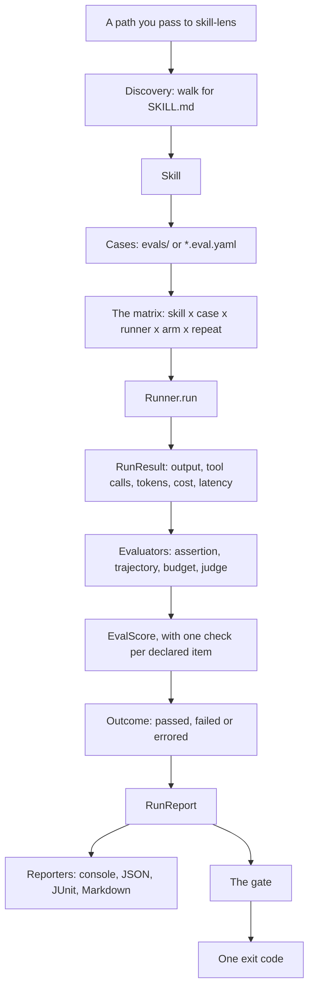
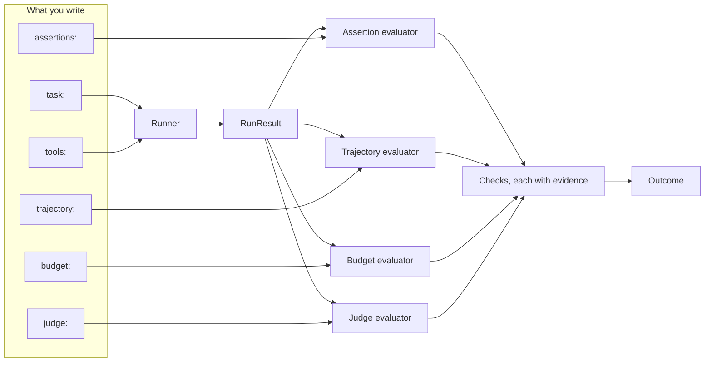
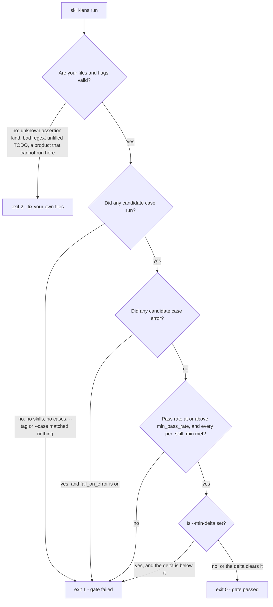
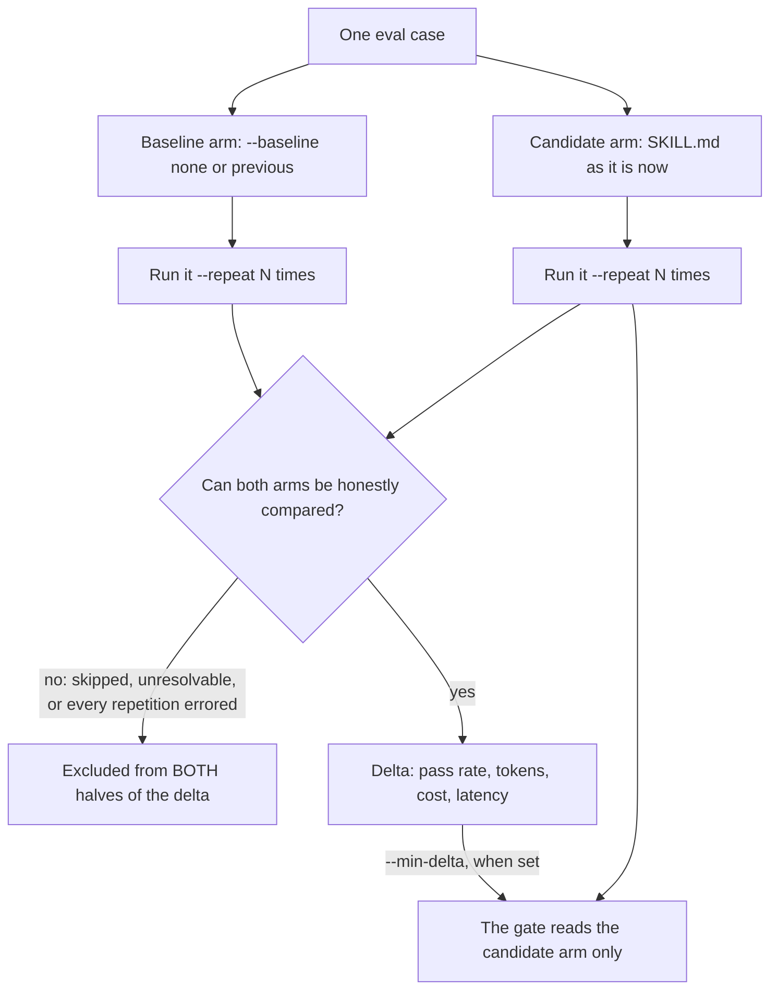
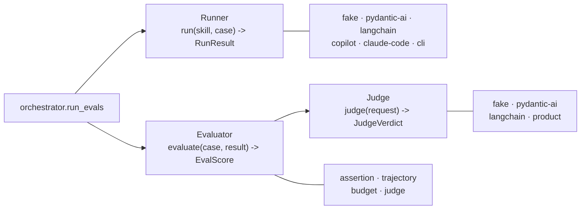

# skill-lens Documentation Restructure Implementation Plan

> **For agentic workers:** REQUIRED SUB-SKILL: Use superpowers:subagent-driven-development (recommended) or superpowers:executing-plans to implement this plan task-by-task. Steps use checkbox (`- [ ]`) syntax for tracking.

**Goal:** Make the skill-lens documentation learnable — drop milestone labels, split the 140 invariants out of `ARCHITECTURE.md`, add a concepts page with diagrams, and restructure the navigation, README and roadmap.

**Architecture:** Four sequenced pull requests, each independently reviewable and revertible. Nothing under `src/skill_lens/` changes, so no behaviour changes: this is a move, a rename, and new prose. Every structural rule the restructure relies on is pinned by a test, so a later change cannot quietly undo it.

**Tech Stack:** Markdown, MkDocs 1.6 with the Material theme, Python-Markdown extensions (`pymdownx.superfences`, `pymdownx.snippets`, `toc`), Mermaid for diagrams, pytest for the documentation guard tests.

**Spec:** [`docs/superpowers/specs/2026-09-22-skill-lens-docs-restructure-design.md`](../specs/2026-09-22-skill-lens-docs-restructure-design.md)

## Global Constraints

These apply to **every** task below.

- **Nothing under `src/skill_lens/` may be modified.** This is a documentation change. If a task seems to need a source change, stop and report it.
- **Conventional Commits, for commit messages *and* pull-request titles.** Pull requests are squash-merged, so the title becomes the commit on `main`, and `cz bump` derives the release version from it. Type is `docs` for every commit in this plan except the two that add tests, which are `test`.
- **`ARCHITECTURE.md` must use absolute links only** (full `https://` URLs), never relative ones. The file is inlined into `docs/architecture.md` by a `pymdownx.snippets` directive, so MkDocs resolves its relative links from `docs/` while `tests/test_docs.py` resolves them from the repository root — a relative link can pass the test and still fail `mkdocs build --strict`.
- **Every new page must be added to `nav:` in `mkdocs.yml`.** `tests/test_docs.py::test_every_page_is_reachable_from_the_nav` fails on an orphan page, and `mkdocs build --strict` fails on a nav entry with no file.
- **`docs/superpowers/` is a historical archive.** It is excluded from the built site and is never edited by these tasks, except to add this plan.
- **All file IO pins `encoding="utf-8"`** in any test helper written here, matching the rest of the repository.
- **Verification trio.** Every task ends by running all three of these and confirming they pass, before committing:

```bash
uv run pytest tests/test_docs.py
uv run mkdocs build --strict
uv run pytest
```

If `mkdocs` is missing, install the docs dependency group first — a plain `uv sync` skips it:

```bash
uv sync --group docs
```

- **Pull requests:** assign to `EmadMokhtar` (a bare login, no `@`), and link the issue in the body with `Closes #N`. End the pull-request description with the attribution line; end commit messages with the `Co-Authored-By` line.

---

## Phase 1 — PR 1: drop milestone labels

Branch: `docs/drop-milestone-labels`
Pull-request title: `docs: drop milestone labels from the documentation`

The guard test is written first and widened task by task. Each task leaves the branch green, because the test only covers the files that task has already fixed.

### Task 1.1: Guard test over `ARCHITECTURE.md`, and fix that file

**Files:**
- Modify: `tests/test_docs.py` (append at the end)
- Modify: `ARCHITECTURE.md` (8 headings, 18 in-body references)

**Interfaces:**
- Consumes: `REPO_ROOT`, `DOCS`, `EXCLUDED_DIR` — module-level constants already defined at `tests/test_docs.py:27-34`.
- Produces: `MILESTONE_RE`, `_milestone_hits(path)` and `test_no_milestone_labels_outside_the_roadmap` — Tasks 1.2 and 1.3 widen the same test rather than adding new ones.

- [ ] **Step 1: Write the failing test**

Append to `tests/test_docs.py`:

```python
# A milestone label ("M4", "M6 part 2") dates a change rather than describing
# it, and it goes stale: README.md said "Milestone 7" while the tool was at M9.
# docs/roadmap.md is the one page where the labels are the subject, and
# CHANGELOG.md is generated by `cz bump` from pre-rename commit subjects.
# CLAUDE.md is an agent instruction file, not documentation, and is out of scope.
MILESTONE_RE = re.compile(r"\bM[0-9]\b|milestone", re.IGNORECASE)

MILESTONE_ALLOWED = {"roadmap.md"}


def _milestone_hits(path: Path) -> list[str]:
    """Every line in `path` that carries a milestone label."""
    lines = path.read_text(encoding="utf-8").splitlines()
    return [
        f"{path.name}:{number}: {line.strip()}"
        for number, line in enumerate(lines, start=1)
        if MILESTONE_RE.search(line)
    ]


def test_no_milestone_labels_outside_the_roadmap():
    hits = _milestone_hits(REPO_ROOT / "ARCHITECTURE.md")
    assert not hits, "milestone labels found:\n" + "\n".join(hits)
```

- [ ] **Step 2: Run the test and confirm it fails**

Run:

```bash
uv run pytest tests/test_docs.py::test_no_milestone_labels_outside_the_roadmap -v
```

Expected: FAIL, listing 26 lines. Copy that list — it is the work list for steps 3 to 7.

- [ ] **Step 3: Rename the eight headings**

Exact replacements in `ARCHITECTURE.md`:

| Line | From | To |
| --- | --- | --- |
| 357 | `### Comparative evals (M4)` | `### Comparative evals` |
| 415 | `### CI surfaces (M5)` | `### Reporting and concurrency` |
| 572 | `### Real-execution tools (M6 part 1)` | `### Workspaces and files` |
| 685 | `### Bundled scripts (M6 part 2)` | `### Bundled scripts and the sandbox` |
| 870 | `### Developer experience (M7)` | `### Failure context and the run matrix` |
| 1027 | `### Per-call mock returns (issue #41)` | `### Per-call mock returns` |
| 1166 | `### Product runners (M9 part 1)` | `### Product runners` |
| 1285 | `### The product judge (M9 part 2)` | `### The product judge` |

Line 1027 carries an issue number rather than a milestone, so the test does not flag it. Rename it anyway: it is the same kind of noise, and PR 2 groups that section with three others.

- [ ] **Step 4: Rewrite the two "written against an earlier milestone" references**

Lines 67 and 97. Both say a keyword is additive so an older runner keeps working. Replace the phrase only:

- `so a runner written against an earlier milestone keeps working` → `so a runner written against an earlier version keeps working`

Line 863 is the same pattern with different wording:

- `so a third-party runner written against M6 part 1 keeps working` → `so a third-party runner written against a version without bundled scripts keeps working`

- [ ] **Step 5: Rewrite the six "pre-M4" / "since M4" references**

| Line | From | To |
| --- | --- | --- |
| 148 | `degrade to exactly the pre-M4 shape.` | `degrade to exactly the single-arm shape.` |
| 160 | `emitted by the judge and, since M4, by assertion/trajectory/budget too` | `emitted by the judge and by assertion/trajectory/budget alike` |
| 178 | `fall back to the\npre-M4 single-arm rendering.` | `fall back to the\nsingle-arm rendering.` |
| 359 | `identical to the single-arm run that predates M4.` | `identical to a single-arm run.` |
| 363 | `because M4 made the assertion, trajectory and budget\nevaluators emit per-check evidence where only the judge did before.` | `because the assertion, trajectory and budget\nevaluators emit per-check evidence, where once only the judge did.` |
| 659 | `Discovery is a\nseparate sequential pass ahead of execution (an M5 invariant), so a bad kind` | `Discovery is a\nseparate sequential pass ahead of execution, so a bad kind` |

- [ ] **Step 6: Rewrite the four references that date a behaviour change**

Lines 453–455 explain that concurrency is not a literal replay of the older behaviour:

- `It is not, though, a literal replay\nof pre-M5 behavior in every respect` → `It is not, though, a literal replay\nof the sequential behaviour in every respect`
- `where before M5, discovery and execution were interleaved\nper skill` → `where once discovery and execution were interleaved\nper skill`

Lines 671–672 use milestones as ordinals for parameter positions. Rewrite naming the parameters:

- From: `M6 part 1's \`keep_workspace\` and \`workspace_limits\` therefore keep their positions after\n\`executor_factory\`, and M6 part 2's \`options\` sits last.`
- To: `\`keep_workspace\` and \`workspace_limits\` therefore keep their positions after\n\`executor_factory\`, and \`options\` — added after both — sits last.`

Line 1256:

- From: `Before\nM9, \`--runner fake --model x\` was silently ignored; with \`--runner copilot\` that silence\nbecomes a mistake that is easy to miss`
- To: `\`--runner fake --model x\` was once silently ignored; with \`--runner copilot\` that silence\nis a mistake that is easy to miss`

- [ ] **Step 7: Rewrite the three remaining references**

| Line | From | To |
| --- | --- | --- |
| 895–896 | `The orchestrator has run a \`skill × case × runner\` matrix since M1 and every\nreporter has keyed on \`CaseOutcome.runner\` since M5; M8 part 2 only let the CLI and the\nconfig name more than one runner.` | `The orchestrator has always run a \`skill × case × runner\` matrix and every\nreporter keys on \`CaseOutcome.runner\`; naming more than one runner on the CLI or in the\nconfig came later.` |
| 1194 | `the M9 probe recorded it from \`/ping\`, loaded mode` | `the probe recorded it from \`/ping\`, loaded mode` |
| 1367 | `per the M9 decision not to normalise tool names across products` | `per the decision not to normalise tool names across products` |

- [ ] **Step 8: Run the test and confirm it passes**

```bash
uv run pytest tests/test_docs.py::test_no_milestone_labels_outside_the_roadmap -v
```

Expected: PASS.

- [ ] **Step 9: Run the verification trio**

```bash
uv run pytest tests/test_docs.py && uv run mkdocs build --strict && uv run pytest
```

Expected: all pass. `mkdocs build --strict` matters here because renaming a heading changes its anchor — if any page linked to `#comparative-evals-m4`, the strict build fails and that link must be updated in the same commit.

- [ ] **Step 10: Commit**

```bash
git add tests/test_docs.py ARCHITECTURE.md
git commit -m "$(cat <<'EOF'
docs: drop milestone labels from ARCHITECTURE.md

A milestone label dates a change rather than describing it, and it goes
stale. Adds a guard test so the labels cannot come back.

Co-Authored-By: Claude Opus 5 <noreply@anthropic.com>
EOF
)"
```

### Task 1.2: Widen the guard to the documentation pages, and fix them

**Files:**
- Modify: `tests/test_docs.py` (the test from Task 1.1)
- Modify: `docs/gating.md:143-147`, `docs/comparative-evals.md:16,26,28`, `docs/security.md:183`, `docs/contributing.md:28`, `docs/index.md:14-27`

**Interfaces:**
- Consumes: `MILESTONE_RE`, `MILESTONE_ALLOWED`, `_milestone_hits` from Task 1.1; `_site_pages()` from `tests/test_docs.py:43`.
- Produces: nothing new — the same test, widened.

- [ ] **Step 1: Widen the test so it fails**

Replace the body of `test_no_milestone_labels_outside_the_roadmap` with:

```python
def test_no_milestone_labels_outside_the_roadmap():
    paths = [REPO_ROOT / "ARCHITECTURE.md"]
    paths += [DOCS / name for name in sorted(_site_pages()) if name not in MILESTONE_ALLOWED]
    hits = [hit for path in paths for hit in _milestone_hits(path)]
    assert not hits, "milestone labels found:\n" + "\n".join(hits)
```

- [ ] **Step 2: Run the test and confirm it fails**

```bash
uv run pytest tests/test_docs.py::test_no_milestone_labels_outside_the_roadmap -v
```

Expected: FAIL, listing 9 lines across five pages.

- [ ] **Step 3: Fix `docs/gating.md:143-147`**

From:

```
Comparative evals changed this document additively, not by rewriting what was already there:
every M3 field means what it always meant, and M4 only adds fields alongside them — `arm` and
`repeat_index` on each outcome, `baseline_errored` in `summary`, and the top-level `delta`
(`null` when no baseline arm ran) and `baseline_notes`. A tool reading only the M3 fields
keeps working unmodified.
```

To:

```
Comparative evals changed this document additively, not by rewriting what was already there:
every field that existed before them still means what it meant, and the comparison adds
fields alongside them — `arm` and `repeat_index` on each outcome, `baseline_errored` in
`summary`, and the top-level `delta` (`null` when no baseline arm ran) and `baseline_notes`.
A tool that reads only the older fields keeps working unmodified.
```

- [ ] **Step 4: Fix `docs/comparative-evals.md:16,26,28`**

| Line | From | To |
| --- | --- | --- |
| 16 | `This is the only arm that\n  existed before M4, and it is the only arm the gate reads.` | `This is the only arm a run\n  without \`--baseline\` produces, and it is the only arm the gate reads.` |
| 26 | `\`skill-lens run\` keeps the same\nlayout it had before M4: one arm, one line per outcome, no delta block.` | `\`skill-lens run\` keeps the single-arm\nlayout: one arm, one line per outcome, no delta block.` |
| 28 | `emit per-check evidence (an M4 addition, previously only the judge evaluator did this), so a` | `emit per-check evidence (once, only the judge evaluator did this), so a` |

- [ ] **Step 5: Fix `docs/security.md:183`**

From: `skill-lens can execute it — that is what M6 part 2\nadds — and the trust model is:`

To: `skill-lens can execute it, and the trust model is:`

- [ ] **Step 6: Fix `docs/contributing.md:28`**

From: `proves the M4 no-name-leak rule survives the wire`

To: `proves the baseline no-name-leak rule survives the wire`

- [ ] **Step 7: Replace the status admonition in `docs/index.md:14-27`**

Delete the whole `!!! info "Status: M9"` block — all 14 lines — and put this in its place:

```markdown
!!! info "Stability"
    This is `0.x`. A minor release may still change behaviour, so pin what you depend on.
    See the [roadmap](roadmap.md) for what is shipped and what is planned.
```

The deleted paragraph listed every feature of the tool. It restates the reference pages below it, and it is stale one release after each edit. Nothing is lost: the "Where to go next" table two sections down already routes the reader to each of those features.

- [ ] **Step 8: Run the test and confirm it passes**

```bash
uv run pytest tests/test_docs.py::test_no_milestone_labels_outside_the_roadmap -v
```

Expected: PASS.

- [ ] **Step 9: Run the verification trio**

```bash
uv run pytest tests/test_docs.py && uv run mkdocs build --strict && uv run pytest
```

- [ ] **Step 10: Commit**

```bash
git add tests/test_docs.py docs/
git commit -m "$(cat <<'EOF'
docs: drop milestone labels from the documentation pages

Also replaces the index page's feature-dump status admonition with a
short stability note; the table below it already routes readers to each
feature, and the paragraph went stale every release.

Co-Authored-By: Claude Opus 5 <noreply@anthropic.com>
EOF
)"
```

### Task 1.3: Widen the guard to `README.md`, and fix the stale status

**Files:**
- Modify: `tests/test_docs.py` (the same test)
- Modify: `README.md:281-288`

**Interfaces:**
- Consumes: the test from Task 1.2.
- Produces: the final form of `test_no_milestone_labels_outside_the_roadmap`.

- [ ] **Step 1: Widen the test so it fails**

Change the first line of the test body from:

```python
    paths = [REPO_ROOT / "ARCHITECTURE.md"]
```

to:

```python
    paths = [REPO_ROOT / "ARCHITECTURE.md", REPO_ROOT / "README.md"]
```

- [ ] **Step 2: Run the test and confirm it fails**

```bash
uv run pytest tests/test_docs.py::test_no_milestone_labels_outside_the_roadmap -v
```

Expected: FAIL on `README.md:282`, which reads `Milestone 7.` while the tool is at M9 — the drift this whole pull request removes.

- [ ] **Step 3: Rewrite the README status section**

Replace `README.md:281-288` (the `## Status` heading and its paragraph) with:

```markdown
## Status

Discovery, scoring, judging, comparison, real-file workspaces, reporting, gating and the
automated release pipeline all ship and are tested. Versions are derived from the commit
history and published to PyPI on merge. This is `0.x`: a minor release may still change
behaviour, so pin what you depend on. See the
[roadmap](https://emadmokhtar.github.io/skill-evaluator/roadmap/) for what is shipped and
what is planned.
```

The milestone number is removed rather than corrected. A number that has to be bumped by hand on every release is the thing that went stale.

- [ ] **Step 4: Run the test and confirm it passes**

```bash
uv run pytest tests/test_docs.py::test_no_milestone_labels_outside_the_roadmap -v
```

Expected: PASS.

- [ ] **Step 5: Run the verification trio**

```bash
uv run pytest tests/test_docs.py && uv run mkdocs build --strict && uv run pytest
```

- [ ] **Step 6: Commit and open the pull request**

```bash
git add tests/test_docs.py README.md
git commit -m "$(cat <<'EOF'
docs: fix the stale milestone in the README status

README.md said "Milestone 7" while the tool was at M9. The number is
removed rather than corrected: a number bumped by hand every release is
what went stale.

Co-Authored-By: Claude Opus 5 <noreply@anthropic.com>
EOF
)"
git push -u origin docs/drop-milestone-labels
gh pr create --assignee EmadMokhtar \
  --title "docs: drop milestone labels from the documentation" \
  --body "$(cat <<'EOF'
Milestone labels date a change rather than describing it, and they go stale:
`README.md` said "Milestone 7" while the tool was at M9.

Renames 8 headings in `ARCHITECTURE.md`, rewrites 26 in-body references there and
9 across five documentation pages, replaces the index page's feature-dump status
admonition with a short stability note, and fixes the README status.

`docs/roadmap.md` keeps its labels — it is the one page where they are the
subject. `CLAUDE.md` is rewritten in the next pull request.

A new guard test, `test_no_milestone_labels_outside_the_roadmap`, stops them
coming back.

Closes #N

🤖 Generated with [Claude Code](https://claude.com/claude-code)
EOF
)"
```

Replace `#N` with the real issue number before running, or drop the line if there is no issue.

---

## Phase 2 — PR 2: split the invariants out of `ARCHITECTURE.md`

Branch: `docs/split-invariants` (from `main`, after PR 1 merges)
Pull-request title: `docs: split the invariants out of ARCHITECTURE.md`

### Task 2.1: Create `docs/invariants.md`

**Files:**
- Create: `docs/invariants.md`
- Modify: `mkdocs.yml` (nav entry, `toc_depth`)

**Interfaces:**
- Consumes: `ARCHITECTURE.md` lines 185–1394 as the source text, with PR 1's headings already renamed.
- Produces: `docs/invariants.md` with nine `##` group headings and 140 `###` claim headings. Task 2.2 links to it; Task 2.4's drift test reads its `###` headings.

- [ ] **Step 1: Copy the invariant text into the new page**

`ARCHITECTURE.md`'s `## Invariants, and why` section runs from line 180 to line 1394. Lines 182–183 are its intro; the invariants themselves are lines 185–1394. Move that text — do not retype it, and do not reword it. Rewriting what an invariant *says* is explicitly out of scope; this pull request changes only where it lives and what shape it takes.

- [ ] **Step 2: Regroup under nine `##` headings**

The current section groups invariants by when they shipped. Regroup by subject.

**The line numbers below are from the tree before PR 1.** PR 1 joined some wrapped lines, so
they have shifted by a few. Use them as a guide and locate each boundary by its heading text
— the eight headings PR 1 renamed — never by number alone.

| New `##` group | Source lines |
| --- | --- |
| `## The core contract` | 185–356 |
| `## Comparative evals` | 358–414 |
| `## Reporting and concurrency` | 416–479 |
| `## Release and supply chain` | 480–571, then 1081–1165 |
| `## Workspaces and files` | 573–684 |
| `## Bundled scripts and the sandbox` | 686–869 |
| `## Failure context and the run matrix` | 871–918 |
| `## Mock tools` | 920–1026, then 1028–1079 |
| `## Product runners` | 1167–1284, 1286–1328, then 1330–1394 |

Two groups merge sections that were split only by shipping date: *Release and supply chain* joins the release invariants with the `### Security checks` section, and *Mock tools* joins MCP import, tool libraries, call arguments and per-call returns. Drop the old `###` sub-headings inside each group; the `###` level is now used for individual invariants.

- [ ] **Step 3: Give every invariant a `###` heading and one shape**

Each invariant is currently a bold-led paragraph. Turn the bold lead into a `###` heading, then order the body as: **why it exists**, then **what enforces it**. Worked example — from:

```markdown
**A run executing zero cases fails the gate.** "Nothing ran" is a broken run, not a pass —
otherwise a mistyped path reports success forever. `gating.evaluate_gate` distinguishes the
causes: no skills found, all skills skipped for having no cases, every case filtered out
by `--tag`, or no case name matched `--case`.
```

to:

```markdown
### A run executing zero cases fails the gate

"Nothing ran" is a broken run, not a pass — otherwise a mistyped path reports success
forever.

`gating.evaluate_gate` enforces it, and distinguishes the causes: no skills found, all
skills skipped for having no cases, every case filtered out by `--tag`, or no case name
matched `--case`.
```

Keep the heading text identical to the bold lead, minus the trailing full stop and any
trailing markup — Task 2.4's test matches it against `CLAUDE.md` byte for byte, so
inconsistency here is caught there.

Where a bold lead is a sentence fragment split across two lines in the source, join it into
one line. Where one bold-led paragraph states two separate rules joined by "and", split it
into two `###` headings: the count rises from the current 140 paragraphs only if a split is
genuinely needed, and Task 2.4 will reconcile whatever number results.

- [ ] **Step 4: Add the page header**

Put this at the top of `docs/invariants.md`, above the first `##`:

```markdown
# Invariants

These are decided behaviours, not accidents. Several were bugs caught in review. Each one
has a test asserting it, so a later change cannot quietly undo it.

This page is a reference to look things up in, not a page to read end to end. For how the
tool is built — the protocols, the module map, the data flow — see
[Architecture](architecture.md).
```

- [ ] **Step 5: Add the page to the nav and limit the table of contents**

In `mkdocs.yml`, add `invariants.md` to the nav immediately after `architecture.md`:

```yaml
  - Architecture: architecture.md
  - Invariants: invariants.md
```

and change the `toc` extension from:

```yaml
  - toc:
      permalink: true
```

to:

```yaml
  # toc_depth stops the 140 invariant headings on invariants.md filling the
  # sidebar; Python-Markdown still gives each one an `id`, so a link to
  # #the-delta-is-paired resolves. What a level-3 heading loses is the
  # clickable permalink icon.
  - toc:
      permalink: true
      toc_depth: 2
```

- [ ] **Step 6: Build the site and check one page by eye**

```bash
uv sync --group docs && uv run mkdocs build --strict
```

Then open `site/invariants/index.html` in a browser. Confirm two things no test can check: the sidebar lists nine groups rather than 140 entries, and a link to a specific invariant anchor — try `site/invariants/index.html#the-delta-is-paired` — jumps to the right heading.

- [ ] **Step 7: Run the verification trio**

```bash
uv run pytest tests/test_docs.py && uv run mkdocs build --strict && uv run pytest
```

- [ ] **Step 8: Commit**

```bash
git add docs/invariants.md mkdocs.yml
git commit -m "$(cat <<'EOF'
docs: add the invariants reference page

Moves the 140 invariants into one page, regrouped by subject instead of
by the milestone that shipped them, each with a heading carrying its
claim and a body in one shape: why it exists, then what enforces it.

ARCHITECTURE.md still carries its own copy; the next commit removes it.

Co-Authored-By: Claude Opus 5 <noreply@anthropic.com>
EOF
)"
```

### Task 2.2: Cut `ARCHITECTURE.md` down to the narrative

**Files:**
- Modify: `ARCHITECTURE.md` (delete lines 180–1394, insert a short section)

**Interfaces:**
- Consumes: `docs/invariants.md` from Task 2.1.
- Produces: an `ARCHITECTURE.md` of roughly 250 lines. Nothing later depends on its line numbers.

- [ ] **Step 1: Delete the invariants**

Delete everything from the `## Invariants, and why` heading up to — but not including — the
`## Extension points` heading. **Locate both by their text, not by line number:** PR 1 joined
some wrapped lines, so the numbers have shifted from the 180/1395 they were at when this plan
was written.

Confirm the text is already in `docs/invariants.md` before deleting: `git diff --stat` on
Task 2.1's commit should show `docs/invariants.md` gaining roughly the number of lines this
deletes.

- [ ] **Step 2: Insert the replacement section**

In the same place, insert:

```markdown
## Invariants

The project keeps a set of decided behaviours — `errored` is never `failed`, an authoring
error never scores as a failure, nothing publishes that was not verified in the same run —
each with a test asserting it. Several were bugs caught in review. They are collected in one
reference, because they are looked up rather than read:

**[Invariants](https://emadmokhtar.github.io/skill-evaluator/invariants/)**

A change that breaks one of them should change that page in the same pull request, or it is
not a decided behaviour any more.
```

That link is absolute, as every link in this file must be: the file is inlined into
`docs/architecture.md` by a snippet, so MkDocs resolves relative links from `docs/` while
`tests/test_docs.py` resolves them from the repository root.

- [ ] **Step 3: Check the file length**

```bash
wc -l ARCHITECTURE.md
```

Expected: roughly 240–260 lines, down from 1,442. If it is far larger, the deletion in step 1 was incomplete.

- [ ] **Step 4: Run the verification trio**

```bash
uv run pytest tests/test_docs.py && uv run mkdocs build --strict && uv run pytest
```

`mkdocs build --strict` is the important one: any page linking into an invariant anchor on
`architecture.md` now fails, and each such link must be repointed at `invariants.md` in this
same commit.

- [ ] **Step 5: Commit**

```bash
git add ARCHITECTURE.md
git commit -m "$(cat <<'EOF'
docs: reduce ARCHITECTURE.md to the design narrative

84% of the file was one flat list of invariants, which now lives on its
own page. What remains is what the file is for: scope, the three
protocols, the module map, the data flow, the models, extension points
and testing tiers.

Co-Authored-By: Claude Opus 5 <noreply@anthropic.com>
EOF
)"
```

### Task 2.3: Shrink `CLAUDE.md`'s "What this is"

**Files:**
- Modify: `CLAUDE.md:5-102`

**Interfaces:**
- Consumes: `docs/invariants.md` from Task 2.1.
- Produces: nothing other tasks read.

- [ ] **Step 1: Replace the section**

`CLAUDE.md`'s `## What this is` section is one ~70-line paragraph listing every milestone in order. Replace lines 5–102 — the heading and everything before `## Commands` at line 103 — with:

```markdown
## What this is

`skill-lens` is a standalone CLI and library that runs evaluations on Anthropic-style Agent
Skills (`SKILL.md` files). Skills under test and their eval cases are **inputs** — nothing
about a skill under test is vendored here. It is meant to run as a CI gate, where the exit
code is the contract, or on demand.

A run discovers skills, loads the eval cases beside them, runs each case through one or more
runners, scores the result with the assertion, trajectory, budget and judge evaluators, and
turns the whole run into one exit code.

- How it is built: [`ARCHITECTURE.md`](ARCHITECTURE.md)
- The decided behaviours and what enforces each: [`docs/invariants.md`](docs/invariants.md)
- What is shipped and what is planned: [`docs/roadmap.md`](docs/roadmap.md)
- Design specs, per feature: `docs/superpowers/specs/`
```

The milestone paragraph is deleted, not summarised. It recorded the order features arrived, which changes nothing about how to work in the repository today, and every specific claim in it is stated more precisely in the files now linked.

- [ ] **Step 2: Confirm nothing else referenced it**

```bash
grep -n 'What this is' CLAUDE.md .github/instructions/*.md
```

Expected: one hit, the heading itself.

- [ ] **Step 3: Run the verification trio**

```bash
uv run pytest tests/test_docs.py && uv run mkdocs build --strict && uv run pytest
```

- [ ] **Step 4: Commit**

```bash
git add CLAUDE.md
git commit -m "$(cat <<'EOF'
docs: replace CLAUDE.md's milestone paragraph with links

The section was a 70-line list of the order features arrived in, which
says nothing about how to work in the repository today. Every specific
claim in it is stated more precisely in the files it now links to.

Co-Authored-By: Claude Opus 5 <noreply@anthropic.com>
EOF
)"
```

### Task 2.4: Pin `CLAUDE.md` to `docs/invariants.md` with a drift test

**Files:**
- Create: `tests/test_invariants_sync.py`
- Modify: `CLAUDE.md` — the list under `## Invariants that are easy to break`. **Locate it by
  that heading, not by line number:** Task 2.3 cut about 80 lines above it, so every number
  in the file has moved.

**Interfaces:**
- Consumes: `docs/invariants.md`'s `###` headings from Task 2.1.
- Produces: `tests/test_invariants_sync.py` with `_page_claims()`, `_claude_claims()` and two tests. Nothing later depends on it.

- [ ] **Step 1: Write the failing test**

Create `tests/test_invariants_sync.py`:

```python
"""Pin CLAUDE.md's condensed invariant list to docs/invariants.md.

The duplication is deliberate. CLAUDE.md is loaded into the agent's context
at the start of every session, so an invariant that lives only on the docs
page is one the agent does not know until it reads the file. What is not
acceptable is the two copies drifting apart, which is what this pins.

Matching is exact: a CLAUDE.md bullet's bold lead must equal an
invariants.md heading byte for byte. No normalisation, so no false pass.
"""

from __future__ import annotations

import re
from pathlib import Path

REPO_ROOT = Path(__file__).resolve().parents[1]
INVARIANTS = REPO_ROOT / "docs" / "invariants.md"
CLAUDE_MD = REPO_ROOT / "CLAUDE.md"

# "### A run executing zero cases fails the gate"
HEADING_RE = re.compile(r"^### (.+)$", re.MULTILINE)
# "- **A run executing zero cases fails the gate.** ..." -- the bold lead only.
BULLET_RE = re.compile(r"^- \*\*(.+?)\.?\*\*", re.MULTILINE | re.DOTALL)


def _page_claims() -> list[str]:
    text = INVARIANTS.read_text(encoding="utf-8")
    return [match.strip() for match in HEADING_RE.findall(text)]


def _claude_claims() -> list[str]:
    text = CLAUDE_MD.read_text(encoding="utf-8")
    return [" ".join(match.split()) for match in BULLET_RE.findall(text)]


def test_every_documented_invariant_is_in_claude_md():
    missing = sorted(set(_page_claims()) - set(_claude_claims()))
    assert not missing, (
        "docs/invariants.md headings with no CLAUDE.md bullet:\n  " + "\n  ".join(missing)
    )


def test_every_claude_md_invariant_is_documented():
    extra = sorted(set(_claude_claims()) - set(_page_claims()))
    assert not extra, (
        "CLAUDE.md bullets with no docs/invariants.md heading:\n  " + "\n  ".join(extra)
    )


def test_neither_side_repeats_a_claim():
    for name, claims in (("docs/invariants.md", _page_claims()), ("CLAUDE.md", _claude_claims())):
        duplicates = sorted({claim for claim in claims if claims.count(claim) > 1})
        assert not duplicates, f"{name} states the same claim twice:\n  " + "\n  ".join(duplicates)
```

- [ ] **Step 2: Run the test and confirm it fails**

```bash
uv run pytest tests/test_invariants_sync.py -v
```

Expected: both of the first two tests FAIL. The output is the work list: headings with no bullet, and bullets with no heading.

- [ ] **Step 3: Align the bullets**

Work through both lists. Three kinds of mismatch, and the fix for each:

1. **A heading with no bullet** — `CLAUDE.md` merged two invariants into one bullet. Split the bullet into two, one per heading.
2. **A bullet with no heading** — the wording drifted. Change the `CLAUDE.md` bold lead to match the heading exactly. Never change the heading to match the bullet: `docs/invariants.md` is the version a reader sees.
3. **Both** — usually one invariant whose wording differs. Same fix as (2).

Do not change what a bullet *says* below its bold lead. The condensed body is `CLAUDE.md`'s own, and it is allowed to be shorter than the page's.

- [ ] **Step 4: Update the pointer above the list**

The three lines directly under the `## Invariants that are easy to break` heading and its
opening paragraph currently read:

```markdown
The full rationale for each of these — plus the module map and extension points — is in
[`ARCHITECTURE.md`](ARCHITECTURE.md). Keep the two in sync: this list is the condensed
form, that file is the explanation.
```

Replace with:

```markdown
The full rationale for each of these is in [`docs/invariants.md`](docs/invariants.md); the
module map and extension points are in [`ARCHITECTURE.md`](ARCHITECTURE.md). This list is
the condensed form, that page is the explanation, and `tests/test_invariants_sync.py`
fails if the two drift apart — so a new invariant is added in both places or neither.
```

- [ ] **Step 5: Run the test and confirm it passes**

```bash
uv run pytest tests/test_invariants_sync.py -v
```

Expected: all three PASS.

- [ ] **Step 6: Run the verification trio**

```bash
uv run pytest tests/test_docs.py && uv run mkdocs build --strict && uv run pytest
```

- [ ] **Step 7: Commit and open the pull request**

```bash
git add tests/test_invariants_sync.py CLAUDE.md
git commit -m "$(cat <<'EOF'
test: pin CLAUDE.md's invariant list to docs/invariants.md

CLAUDE.md keeps its full list, because it is loaded into the agent's
context at session start and a link is not a substitute. The test is
what makes the deliberate duplication safe: an exact match, both
directions, no normalisation.

Co-Authored-By: Claude Opus 5 <noreply@anthropic.com>
EOF
)"
git push -u origin docs/split-invariants
gh pr create --assignee EmadMokhtar \
  --title "docs: split the invariants out of ARCHITECTURE.md" \
  --body "$(cat <<'EOF'
`ARCHITECTURE.md` was 1,442 lines, and 84% of it was one flat list of 140
invariants — so the part that explains the architecture was unreadable.

The invariants move to `docs/invariants.md`, regrouped by subject rather than by
the milestone that shipped them, each with a heading carrying its claim and a
body in one shape: why it exists, then what enforces it. `ARCHITECTURE.md` drops
to ~250 lines. `CLAUDE.md` keeps its condensed list — it is loaded into the
agent's context at session start, so a link is not a substitute — and a new test
pins the two copies together.

**Anchors move.** A bookmark to `…/architecture/#some-invariant` on the published
site now breaks; those anchors live under `…/invariants/`. Every in-repository
link is covered by `test_relative_links_resolve`. For a `0.x` project I think
that is acceptable rather than worth a redirect map.

Closes #N

🤖 Generated with [Claude Code](https://claude.com/claude-code)
EOF
)"
```

---

## Phase 3 — PR 3: concepts page, glossary and diagrams

Branch: `docs/concepts-and-diagrams` (from `main`, after PR 2 merges)
Pull-request title: `docs: add a concepts page, a glossary and diagrams`

### Task 3.1: Enable Mermaid

**Files:**
- Modify: `tests/test_docs.py:52-68` (`_nav_pages`) and `tests/test_docs.py:168-171` (`test_releasing_is_in_the_nav`)
- Modify: `mkdocs.yml` (`markdown_extensions`)
- Modify: `.github/instructions/docs.instructions.md:25-26`

**Interfaces:**
- Consumes: `MKDOCS_YML` at `tests/test_docs.py:29`.
- Produces: `_mkdocs_config()` in `tests/test_docs.py`, which Tasks 3.2 and 4.2 use instead of calling `safe_load` on `mkdocs.yml` directly.

- [ ] **Step 1: Write the failing test**

Mermaid needs a `!!python/name:` YAML tag in `mkdocs.yml`. `tests/test_docs.py` parses that file with `skill_lens.yaml_loading.safe_load`, a `SafeLoader` subclass, which raises `ConstructorError` on an unknown tag — which is why Mermaid is banned today. Add this test to `tests/test_docs.py`:

```python
def test_the_mkdocs_config_parses_with_a_python_name_tag():
    """mkdocs.yml carries `!!python/name:` tags (Mermaid's custom fence needs
    one). The project's own safe_load refuses unknown tags, which is right for
    user YAML and wrong here, so the tests parse mkdocs.yml with a loader that
    ignores them. This test fails if that loader is swapped back.
    """
    config = _mkdocs_config()
    fences = config["markdown_extensions"]
    superfences = next(
        entry["pymdownx.superfences"]
        for entry in fences
        if isinstance(entry, dict) and "pymdownx.superfences" in entry
    )
    names = [fence["name"] for fence in superfences["custom_fences"]]
    assert "mermaid" in names, f"no mermaid custom fence in mkdocs.yml: {names}"
```

- [ ] **Step 2: Run it and confirm it fails**

```bash
uv run pytest tests/test_docs.py::test_the_mkdocs_config_parses_with_a_python_name_tag -v
```

Expected: FAIL with `NameError: name '_mkdocs_config' is not defined`.

- [ ] **Step 3: Add the tolerant loader**

Add to `tests/test_docs.py`, just below the `MKDOCS_YML` constant at line 29:

```python
class _TagTolerantLoader(yaml.SafeLoader):
    """A loader for mkdocs.yml only.

    mkdocs.yml carries `!!python/name:` tags, which MkDocs resolves at build
    time and a SafeLoader refuses. These tests only read the nav and the
    extension names, so an unknown tag can safely become None. The project's
    own skill_lens.yaml_loading.safe_load is deliberately NOT changed: it
    guards user-authored YAML, where an unknown tag must still be refused.
    """


_TagTolerantLoader.add_multi_constructor("", lambda loader, suffix, node: None)


def _mkdocs_config() -> dict:
    return yaml.load(MKDOCS_YML.read_text(encoding="utf-8"), Loader=_TagTolerantLoader)
```

Add `import yaml` to the imports at the top of the file. Then replace the two places that parse `mkdocs.yml` with `safe_load`:

- In `_nav_pages()` (line 54): `config = safe_load(MKDOCS_YML.read_text(encoding="utf-8"))` → `config = _mkdocs_config()`
- In `test_releasing_is_in_the_nav()` (line 170): `nav = safe_load((REPO_ROOT / "mkdocs.yml").read_text(encoding="utf-8"))["nav"]` → `nav = _mkdocs_config()["nav"]`

If `safe_load` now has no other use in the file, remove its import.

- [ ] **Step 4: Add the Mermaid fence to `mkdocs.yml`**

Change the `pymdownx.superfences` entry from:

```yaml
  - pymdownx.superfences
```

to:

```yaml
  # The custom fence renders ```mermaid blocks as diagrams. The
  # `!!python/name:` tag is what MkDocs needs and what a plain SafeLoader
  # refuses; tests/test_docs.py parses this file with a tag-tolerant loader.
  - pymdownx.superfences:
      custom_fences:
        - name: mermaid
          class: mermaid
          format: !!python/name:pymdownx.superfences.fence_code_format
```

- [ ] **Step 5: Run the test and confirm it passes**

```bash
uv run pytest tests/test_docs.py -v
```

Expected: all pass, including the nav tests that now use the new loader.

- [ ] **Step 6: Prove a diagram actually renders**

Temporarily append this to `docs/index.md`:

````markdown

````

Then:

```bash
uv sync --group docs && uv run mkdocs build --strict
grep -c 'class="mermaid"' site/index.html
```

Expected: `1`. Open `site/index.html` in a browser and confirm three connected boxes appear rather than a code block. Then **remove the temporary block** from `docs/index.md` — do not commit it.

- [ ] **Step 7: Lift the ban in the instructions file**

In `.github/instructions/docs.instructions.md`, replace:

```markdown
- Do not add `pymdownx.emoji` or mermaid `custom_fences` to `mkdocs.yml`: both need
  `!!python/name:` YAML tags, which break the plain-YAML nav parsing in `tests/test_docs.py`.
```

with:

```markdown
- **`!!python/name:` tags in `mkdocs.yml` are fine**, as long as `tests/test_docs.py` parses
  the file with `_mkdocs_config()` — its tag-tolerant loader — rather than the project's
  `safe_load`, which refuses unknown tags. Mermaid's `custom_fences` entry needs one.
  `skill_lens.yaml_loading.safe_load` itself must not be loosened: it guards user YAML.
- **Diagrams are Mermaid**, in a ```mermaid fence. GitHub renders them natively, so
  `README.md` and `ARCHITECTURE.md` get diagrams too. No hard-coded colours — the default
  theme follows the page, so a diagram stays legible in both light and dark mode.
```

- [ ] **Step 8: Run the verification trio**

```bash
uv run pytest tests/test_docs.py && uv run mkdocs build --strict && uv run pytest
```

- [ ] **Step 9: Commit**

```bash
git add tests/test_docs.py mkdocs.yml .github/instructions/docs.instructions.md
git commit -m "$(cat <<'EOF'
build: render mermaid diagrams in the docs

The ban existed because mermaid's custom fence needs a !!python/name:
tag and the nav tests parsed mkdocs.yml with a SafeLoader. The fix is
local to the tests: a tag-tolerant loader for that one file. The
project's own safe_load is unchanged -- it guards user YAML.

Co-Authored-By: Claude Opus 5 <noreply@anthropic.com>
EOF
)"
```

### Task 3.2: Write `docs/concepts.md`

**Files:**
- Create: `docs/concepts.md`
- Modify: `mkdocs.yml` (nav), `docs/index.md` (the "Where to go next" table), `README.md` (the documentation table)

**Interfaces:**
- Consumes: the Mermaid fence from Task 3.1.
- Produces: `docs/concepts.md` with `## The pipeline` and `## A case, end to end` sections, which Task 3.3 puts diagrams into, and a `## Glossary` table.

- [ ] **Step 1: Write the page**

Create `docs/concepts.md`. One section per concept, in pipeline order so the page reads as a story. Each section: a plain-English definition, one concrete example, and a link to the reference page. Sections, in this order:

1. `## Skill` — a directory with a `SKILL.md` file. Its frontmatter `name`, `description` and `version`; the bundle (`scripts/`, `references/`, `assets/`) beside it. → [Eval files](eval-files.md)
2. `## Eval case` — one task plus what you expect of it, in YAML beside the skill. Suites live in `evals/` or in `*.eval.yaml`. Tags filter them. → [Eval files](eval-files.md)
3. `## Task and mode` — the task is the prompt. `loaded` mode hands the agent the skill; `offered` mode does not, and measures whether the agent reached for it. → [Did the agent reach for the skill?](eval-files.md#did-the-agent-reach-for-the-skill)
4. `## Runner` — the thing that actually runs the case. Three kinds: `fake` (scripted, offline, free), a framework (`pydantic-ai`, `langchain`, needs an API key), a product (`copilot`, `claude-code`, `cli`, needs the product installed, no key). → [Runners](runners.md)
5. `## Mock tools` — a tool the agent can call whose answer you write yourself, so a case is deterministic and costs nothing to serve. `tool_libraries:` shares them across files. → [Mock tools](eval-files.md#mock-tools)
6. `## Workspace` — a temporary directory a case gets, with `list_files` / `read_file` / `write_file`, so a case can check the files a skill produces. → [The workspace](runners.md#the-workspace)
7. `## Evaluator` — the thing that scores a result. Four kinds: assertion (the output text), trajectory (which tools, in what order, with what arguments), budget (tokens, cost, latency), judge (output quality, against a rubric). → [Eval files](eval-files.md)
8. `## Check, evidence and score` — an evaluator emits one `CheckResult` per declared item: an id, pass or fail, and the evidence for it. A check that passes with no evidence is recorded as a failure. → [Per-check results](eval-files.md#per-check-results)
9. `## Outcome: passed, failed, errored` — `failed` means the case ran and scored below the bar, a signal about the skill. `errored` means the harness blew up, a signal about the infrastructure. Conflating them makes a broken API key look like a bad skill. → [Gating](gating.md)
10. `## Arm, baseline and delta` — every case can run twice: the `candidate` arm is the skill as it is now, the `baseline` arm is either an empty skill or the previous version from git. The difference is the delta. Only the candidate arm feeds the gate. → [Comparative evals](comparative-evals.md)
11. `## Gate and exit codes` — the whole run becomes one exit code: `0` passed, `1` failed, `2` something in your own files is wrong. → [Gating and exit codes](gating.md)

Worked example of the shape every section takes — definition, example, link — using
section 9:

```markdown
## Outcome: passed, failed, errored

Every case ends in exactly one of three states, and the difference between the last two is
the most important distinction in the tool.

- **passed** — the case ran and cleared the bar.
- **failed** — the case ran and scored below the bar. This is a signal about *the skill*.
- **errored** — the harness itself blew up: the provider returned a 500, the API key was
  missing, the product exited non-zero, the judge's reply held no readable verdict. This is
  a signal about *the infrastructure*.

Conflating them would make a broken API key look like a badly written skill. An errored case
fails the gate by default, so continuous integration never goes green on a run that did not
actually happen.

```
[PASS] refund :: never leaks a stack trace (fake)
[FAIL] refund :: refuses a refund outside the return window (fake)
        trajectory: lookup_order was never called
```

See [Gating and exit codes](gating.md).
```

Every other section follows that shape. Keep each one under about 150 words: this page routes
a reader to the reference page, it does not replace it.

Add two more sections that hold this task's diagrams (Task 3.3 fills them):

- `## The pipeline`, placed directly after the page's opening paragraph.
- `## A case, end to end`, placed after `## Eval case`.

- [ ] **Step 2: Write the glossary**

End the page with:

```markdown
## Glossary

| Term | Meaning |
| --- | --- |
| Agent Skill | A directory holding a `SKILL.md` file: instructions an agent loads to do one kind of task. |
| Arm | One side of a comparison run — `candidate` (the skill as it is now) or `baseline`. |
| Assertion | A rule checked against the agent's final output text, such as `contains` or `regex`. |
| Baseline | What the candidate is measured against: an empty skill (`none`) or the previous version (`previous`). |
| Budget | A limit on tokens, cost or latency that a case declares and the run checks. |
| Bundle | The `scripts/`, `references/` and `assets/` directories beside a `SKILL.md`. |
| Candidate | The arm running the skill under test. The only arm the gate reads. |
| Case | One task plus what you expect of it, written in YAML beside the skill. |
| Cassette | A recorded provider response replayed in tests, so the suite runs offline. |
| Check | One pass-or-fail verdict with its evidence, emitted by an evaluator. |
| Delta | The measured difference between the candidate and baseline arms. |
| Errored | The harness blew up. An infrastructure signal, not a verdict on the skill. |
| Evaluator | Something that scores a run result. Four ship: assertion, trajectory, budget, judge. |
| Failed | The case ran and scored below the bar. A signal about the skill. |
| Gate | The rule that turns a whole run into one exit code. |
| Judge | A model that grades output quality against a rubric you write, check by check. |
| `loaded` / `offered` | Whether the agent is handed the skill, or left to reach for it. |
| Mock tool | A tool whose answer you write yourself, so a case is deterministic and free. |
| Outcome | The result of one (skill, case, runner, arm, repetition): passed, failed or errored. |
| Preflight | Checks run once before any case, so a run refuses what it cannot serve before spending. |
| Product runner | An installed agent product — GitHub Copilot CLI, Claude Code — driven as the runner. |
| Rubric | The list of `judge:` checks a judge grades the output against. |
| Runner | The thing that actually runs a case and returns a result. |
| Skill | Short for Agent Skill: the directory under test. |
| Tool library | A YAML file of mock tools, imported by several eval files with `tool_libraries:`. |
| Trajectory | Which tools were called, in what order, how many times, and with what arguments. |
| Workspace | The temporary directory a case gets, so it can produce and check real files. |
```

- [ ] **Step 3: Add it to the nav and the two tables**

In `mkdocs.yml`, add it after Getting started:

```yaml
  - Getting started: getting-started.md
  - Concepts: concepts.md
```

In `docs/index.md`'s "Where to go next" table, add as the second row:

```markdown
| Learn the vocabulary — case, runner, judge, arm, gate | [Concepts](concepts.md) |
```

In `README.md`'s Documentation table, add as the second row:

```markdown
| The vocabulary, with a glossary | [Concepts](https://emadmokhtar.github.io/skill-evaluator/concepts/) |
```

- [ ] **Step 4: Run the verification trio**

```bash
uv run pytest tests/test_docs.py && uv run mkdocs build --strict && uv run pytest
```

`test_every_page_is_reachable_from_the_nav` fails if step 3's nav entry was missed, and `test_relative_links_resolve` fails on any dead link in the new page.

- [ ] **Step 5: Commit**

```bash
git add docs/concepts.md mkdocs.yml docs/index.md README.md
git commit -m "$(cat <<'EOF'
docs: add a concepts page with a glossary

Every page assumed the vocabulary -- case, runner, evaluator, judge,
arm, delta, gate -- and nothing defined it. One page now does, in
pipeline order, with a glossary table for lookup.

Co-Authored-By: Claude Opus 5 <noreply@anthropic.com>
EOF
)"
```

### Task 3.3: Add the five diagrams

**Files:**
- Modify: `docs/concepts.md` (two diagrams), `docs/gating.md` (one), `docs/comparative-evals.md` (one), `ARCHITECTURE.md` (one)

**Interfaces:**
- Consumes: the Mermaid fence from Task 3.1; the `## The pipeline` and `## A case, end to end` sections from Task 3.2.
- Produces: nothing other tasks read.

- [ ] **Step 1: The pipeline diagram**

Under `## The pipeline` in `docs/concepts.md`:

````markdown

````

- [ ] **Step 2: The case-anatomy diagram**

Under `## A case, end to end` in `docs/concepts.md`:

````markdown

````

- [ ] **Step 3: The exit-code diagram**

In `docs/gating.md`, directly after the exit-code table (which ends at line 9):

````markdown

````

- [ ] **Step 4: The two-arms diagram**

In `docs/comparative-evals.md`, at the end of the `## The two arms` section (before `## How \`previous\` is resolved` at line 58):

````markdown

````

- [ ] **Step 5: The protocols diagram**

In `ARCHITECTURE.md`, at the end of the `## The three protocols` section, after the paragraph about `preflight`:

````markdown

````

- [ ] **Step 6: Build and check every diagram by eye**

```bash
uv sync --group docs && uv run mkdocs build --strict
grep -c 'class="mermaid"' site/concepts/index.html site/gating/index.html site/comparative-evals/index.html site/architecture/index.html
```

Expected: `2`, `1`, `1`, `1`. Then open each page in a browser and confirm the diagram renders as a picture, not a code block. Toggle the site's dark mode and confirm each is still legible — no diagram may hard-code a colour.

- [ ] **Step 7: Check the GitHub rendering of `ARCHITECTURE.md`**

GitHub renders Mermaid in Markdown files natively, which is why `ARCHITECTURE.md` gets one. After pushing, open the file on GitHub and confirm the diagram renders there too. If it does not, the fence is malformed — GitHub is stricter about the opening fence than MkDocs is.

- [ ] **Step 8: Run the verification trio**

```bash
uv run pytest tests/test_docs.py && uv run mkdocs build --strict && uv run pytest
```

- [ ] **Step 9: Commit and open the pull request**

```bash
git add docs/concepts.md docs/gating.md docs/comparative-evals.md ARCHITECTURE.md
git commit -m "$(cat <<'EOF'
docs: add five diagrams

The pipeline and a case's anatomy on the concepts page, the exit-code
decision on the gating page, the two arms on the comparative page, and
the three protocols in ARCHITECTURE.md, which GitHub renders too.

Co-Authored-By: Claude Opus 5 <noreply@anthropic.com>
EOF
)"
git push -u origin docs/concepts-and-diagrams
gh pr create --assignee EmadMokhtar \
  --title "docs: add a concepts page, a glossary and diagrams" \
  --body "$(cat <<'EOF'
Every page assumed the vocabulary — case, runner, evaluator, judge, arm, delta,
gate — and nothing defined it. There was also exactly one diagram in the whole
project, and none on a user-facing page.

Adds `docs/concepts.md`: one short section per concept in pipeline order, each
with a definition, an example and a link to the reference page, closing with a
glossary table. Adds five Mermaid diagrams.

Mermaid was banned because its custom fence needs a `!!python/name:` tag and the
nav tests parsed `mkdocs.yml` with a `SafeLoader`. The fix is local to the tests
— a tag-tolerant loader for that one file. `skill_lens.yaml_loading.safe_load`
is unchanged: it guards user YAML, where an unknown tag must still be refused.

Closes #N

🤖 Generated with [Claude Code](https://claude.com/claude-code)
EOF
)"
```

---

## Phase 4 — PR 4: navigation, README and roadmap

Branch: `docs/restructure-nav-readme-roadmap` (from `main`, after PR 3 merges)
Pull-request title: `docs: restructure the navigation, README and roadmap`

### Task 4.1: Add `docs/troubleshooting.md`

**Files:**
- Create: `docs/troubleshooting.md`
- Modify: `mkdocs.yml` (nav)

**Interfaces:**
- Consumes: nothing from earlier tasks.
- Produces: `docs/troubleshooting.md`, which Task 4.2 places in the Guides nav section.

This task comes before the nav restructure because `mkdocs build --strict` fails on a nav entry with no file: the page must exist before Task 4.2 lists it.

- [ ] **Step 1: Write the page**

Create `docs/troubleshooting.md`, keyed by the message the user sees rather than by the feature that emits it. One `##` per symptom: what you see, what it means, what to do. Cover these, in this order:

1. `## Exit code 2: something in your own files is wrong` — the general rule, and the list: unknown assertion `kind`, malformed regex, unknown YAML key (`extra="forbid"` catches a typo like `assertion:`), a case still containing `TODO(skill-lens)`.
2. `## "no eval cases ran"` — the four causes `gating.evaluate_gate` distinguishes: no skills found, all skills skipped for having no cases, every case filtered out by `--tag`, no case name matched `--case`. A run executing zero cases fails on purpose.
3. `## A baseline that could not be resolved` — what `BaselineUnavailable` means, the causes (no `git`, not a repository, `SKILL.md` untracked, history window exhausted, a `version:` unchanged). Without `--min-delta` it is a note; with it, the gate fails, because "we could not check" must never read as "nothing changed".
4. `## A token limit that was not evaluated` — `usage_note`, a product runner that cannot report a token split, and why a declared `max_tokens` then fails as *not evaluated* rather than passing.
5. `## A model with no price` — `cost_note`, `cost_usd = 0.0`, and why `max_cost_usd` under an unpriced model fails the case: drop the limit for that provider rather than relying on a silent skip.
6. `## NO_RESPONSE_SCRIPTED` — a mock tool was called with arguments no `when:` entry answers. Add a fallback entry with no `when:`, or widen an existing one.
7. `## UndeclaredTool` — a `trajectory:` names a tool the case does not declare, refused in the runner's preflight before any spend. Note that a product runner refuses no name, because a product's own tools cannot be listed.
8. `## A product runner that cannot run here` — executable not on `PATH`, a preset's `--version` failing, `tools:` under `cli`, `trajectory:` or `mode: offered` under `cli`, a `--model` or `--judge-model` nothing reads.
9. `## script_sandbox = "required"` with no backend — `sandbox-exec` on macOS, `bwrap` on Linux, neither on Windows. Exit 2 in preflight, before any case runs.

Every entry links to the reference page that covers it in full.

- [ ] **Step 2: Add it to the nav**

For now, add it at the end of the existing `Reference:` list in `mkdocs.yml`. Task 4.2 moves it into Guides.

- [ ] **Step 3: Run the verification trio**

```bash
uv run pytest tests/test_docs.py && uv run mkdocs build --strict && uv run pytest
```

- [ ] **Step 4: Commit**

```bash
git add docs/troubleshooting.md mkdocs.yml
git commit -m "$(cat <<'EOF'
docs: add a troubleshooting page

Each of these messages was explained where it was implemented, not
where you hit it. The page is keyed by what you actually see.

Co-Authored-By: Claude Opus 5 <noreply@anthropic.com>
EOF
)"
```

### Task 4.2: Restructure the navigation

**Files:**
- Modify: `mkdocs.yml` (`nav`)
- Modify: `.github/instructions/docs.instructions.md`

**Interfaces:**
- Consumes: `docs/concepts.md` (Task 3.2), `docs/invariants.md` (Task 2.1), `docs/troubleshooting.md` (Task 4.1).
- Produces: the final nav shape. Nothing later changes it.

- [ ] **Step 1: Replace the nav**

```yaml
nav:
  - Home: index.md
  - Guides:
      - Getting started: getting-started.md
      - Concepts: concepts.md
      - Writing evals: writing-evals.md
      - CI integration: ci.md
      - Troubleshooting: troubleshooting.md
  - Reference:
      - Eval files: eval-files.md
      - CLI: cli.md
      - Configuration: configuration.md
      - Runners: runners.md
      - Gating and exit codes: gating.md
      - Comparative evals: comparative-evals.md
  - Internals:
      - Architecture: architecture.md
      - Invariants: invariants.md
      - Security: security.md
      - Releasing: releasing.md
      - Contributing: contributing.md
  - Roadmap: roadmap.md
```

`writing-evals.md` moves out of Reference: it is a 37-line guide to installing an Agent Skill, not reference material. `ci.md` moves out of Reference for the same reason.

- [ ] **Step 2: Add the nav rule to the instructions file**

In `.github/instructions/docs.instructions.md`, after the existing "A new page must be added to `nav:`" bullet, add:

```markdown
- **The nav has four sections, and a new page belongs to one of them.** *Guides* is read
  start to finish. *Reference* is looked things up in. *Internals* is for people working on
  skill-lens itself. *Roadmap* stands alone. A page that fits none of them probably belongs
  inside an existing page as a section.
```

- [ ] **Step 3: Run the verification trio**

```bash
uv run pytest tests/test_docs.py && uv run mkdocs build --strict && uv run pytest
```

`test_every_page_is_reachable_from_the_nav` and `test_the_nav_has_no_missing_pages` both read the flattened nav, so a page dropped during the rewrite fails loudly.

- [ ] **Step 4: Commit**

```bash
git add mkdocs.yml .github/instructions/docs.instructions.md
git commit -m "$(cat <<'EOF'
docs: group the navigation into guides, reference and internals

A flat Reference list held a getting-started guide, a CI walkthrough and
six reference pages. The four sections say who each page is for.

Co-Authored-By: Claude Opus 5 <noreply@anthropic.com>
EOF
)"
```

### Task 4.3: Add the two decision guides

**Files:**
- Modify: `docs/runners.md` (insert after line 20, before `## Two frameworks, one measurement`)
- Modify: `docs/eval-files.md` (insert after line 21, before `## Workspaces`)

**Interfaces:**
- Consumes: nothing from earlier tasks.
- Produces: nothing later tasks read.

- [ ] **Step 1: Add "Choosing a runner" to `docs/runners.md`**

Insert as the page's first `##` section:

```markdown
## Choosing a runner

| Runner | What it costs | Needs | Measures |
| --- | --- | --- | --- |
| `fake` | Nothing. Offline, scripted, deterministic | Nothing | The pipeline itself. Use it to check a suite is wired up before you spend anything |
| `pydantic-ai` | Provider tokens | `[pydantic-ai]` extra and an API key | Output, mock tools, trajectory, tokens, cost, latency, `offered` mode |
| `langchain` | Provider tokens | `[langchain]` extra and an API key | The same as `pydantic-ai`, through a second framework |
| `copilot` | Your GitHub Copilot quota | GitHub Copilot CLI installed | Output, trajectory, the skill-load signal, and mock tools through the MCP bridge. No API key |
| `claude-code` | Your Claude subscription or quota | Claude Code installed | The same as `copilot` |
| `cli` | Whatever the command costs | A `[runners.cli]` table naming the command | Output only. No `tools:`, no `trajectory:`, no `offered` mode |

Two rules worth knowing before you choose:

- **`--runner` is repeatable**, so one invocation can run every case through several
  frameworks. A runner named twice is a user error, not silently de-duplicated.
- **Naming a product runner is a trust decision.** The product runs with prompts disabled,
  the full environment and no sandbox. Every report says so.
```

- [ ] **Step 2: Add "Choosing a check" to `docs/eval-files.md`**

Insert as the page's first `##` section:

```markdown
## Choosing a check

Four kinds of check, and each answers a different question.

| Use | When you want to know | Costs |
| --- | --- | --- |
| `assertions:` | Did the output contain, or not contain, specific text? | Nothing |
| `trajectory:` | Did the agent call the right tools, in the right order, with the right arguments? | Nothing |
| `budget:` | Did it stay inside a token, cost or latency limit? | Nothing |
| `judge:` | Is the output *good* — complete, correctly reasoned, in the right tone? | A judge model call per case |

Reach for the cheapest one that answers your question. An `assertions:` entry is exact and
free; a `judge:` rubric is the only thing that can grade quality, and it costs a model call
per case. A skill whose job is to *call something* is measured by `trajectory:`, not by what
it said about calling it.

Some rules that catch people out:

- A rubric entry phrased against a mock tool's `returns:` is an authoring error. The judge
  never sees a tool's return, so that entry is unverifiable — reword it, or name a
  `workspace:` file under `judge.artifacts`.
- A check that passes with no evidence is recorded as a failure.
- A `trajectory:` naming a tool the case does not declare is refused before any case runs.
```

- [ ] **Step 3: Run the verification trio**

```bash
uv run pytest tests/test_docs.py && uv run mkdocs build --strict && uv run pytest
```

- [ ] **Step 4: Commit**

```bash
git add docs/runners.md docs/eval-files.md
git commit -m "$(cat <<'EOF'
docs: open runners and eval-files with a decision guide

Which runner to use was spread across four pages, and which check to use
was written down only inside the writing-skill-evals skill. Each is now
a table at the top of the page it belongs to, rather than a page of its
own that would clutter the nav.

Co-Authored-By: Claude Opus 5 <noreply@anthropic.com>
EOF
)"
```

### Task 4.4: Shrink `README.md` to a landing page

**Files:**
- Modify: `README.md` (delete lines 42–234, keep the rest)

**Interfaces:**
- Consumes: `docs/getting-started.md`, which must already contain everything removed.
- Produces: nothing later tasks read.

- [ ] **Step 1: Check each block has a home before deleting it**

`README.md` currently holds five tutorial sections that `.github/instructions/docs.instructions.md` says belong in `docs/`. For each, confirm `docs/getting-started.md` covers the same ground:

| README section | Lines | Covered by |
| --- | --- | --- |
| `## Try it — free, offline, no API key` | 42–103 | Getting started steps 1, 2 and 5 |
| `## A case is a few lines of YAML` | 104–136 | Getting started step 3 |
| `## A run reads like a test suite` | 137–179 | Getting started step 5 |
| `## Gate your pull requests` | 180–216 | Getting started step 8, and `docs/ci.md` |
| `## Why a green run means something` | 217–234 | `docs/gating.md` |

Read both sides. **If any content has no home, move it into `docs/getting-started.md` first, in this same task, before deleting it from the README.** Losing it is the one failure mode here.

- [ ] **Step 2: Delete lines 42–234 and add one short example**

In place of the deleted sections, put a single example so a visitor sees what an eval file looks like without leaving the page:

````markdown
## What an eval looks like

```yaml
# skills/refund/evals/refund.eval.yaml
cases:
  - name: refuses a refund outside the return window
    task: I want a refund for order 1234
    tools:
      - name: lookup_order
        description: Look up an order by its id
        parameters:
          order_id: string
        returns: '{"id": "1234", "delivered_days_ago": 61}'
    assertions:
      - kind: contains
        value: "30-day"
    trajectory:
      called: [lookup_order]
```

```bash
skill-lens run ./skills          # exit 0 passed, 1 failed, 2 your files are wrong
```

Start at [Getting started](https://emadmokhtar.github.io/skill-evaluator/getting-started/),
which takes one skill from nothing to a CI gate.
````

Keep `## Why`, `## What it measures`, `## Documentation`, `## Contributing`, `## Status` and `## License` as they are.

- [ ] **Step 2b: Check the instructions file still describes the README correctly**

`.github/instructions/docs.instructions.md` opens with: "`README.md` is a landing page.
Reference prose lives in `docs/`. Flag any PR that reintroduces command, config or eval-file
reference material into the README — it will drift." Read it against the new README. The rule
was already right — this task is what makes the file comply with it — so expect no change. If
the shortened README contradicts any part of it, fix the README, not the rule.

- [ ] **Step 3: Check the length**

```bash
wc -l README.md
```

Expected: roughly 90–110 lines, down from 292.

- [ ] **Step 4: Run the verification trio**

```bash
uv run pytest tests/test_docs.py && uv run mkdocs build --strict && uv run pytest
```

- [ ] **Step 5: Commit**

```bash
git add README.md docs/getting-started.md
git commit -m "$(cat <<'EOF'
docs: reduce the README to a landing page

The repository's own documentation rule says reference prose lives in
docs/, and the README had drifted into a five-section tutorial that
getting-started.md already covers. Every removed block was checked
against that page first.

Co-Authored-By: Claude Opus 5 <noreply@anthropic.com>
EOF
)"
```

### Task 4.5: Rework the roadmap

**Files:**
- Modify: `docs/roadmap.md` (replace lines 16–199, keep the milestone table at lines 1–15)

**Interfaces:**
- Consumes: nothing from earlier tasks.
- Produces: nothing later tasks read.

- [ ] **Step 1: Keep the milestone table, delete the nine narrative sections**

Lines 3–14 hold a milestone table. Keep it — this is the one page where the labels are the subject, and `MILESTONE_ALLOWED` in Task 1.1's test exempts this file. Delete lines 16–193, the nine `## What MX shipped` sections. Keep `## The rename to skill-lens` at line 194.

- [ ] **Step 2: Add a capability table**

In place of the deleted sections:

```markdown
## What's shipped

Organised by what it does, not by when it arrived. For the change-by-change history, see
[CHANGELOG.md](https://github.com/EmadMokhtar/skill-evaluator/blob/main/CHANGELOG.md),
which `cz bump` generates from the commit history.

| Capability | Where it is documented |
| --- | --- |
| Discovery, cases, assertions, the gate and its exit codes | [Gating](gating.md) |
| Mock tools, tool libraries, per-call returns, call-argument checks | [Eval files](eval-files.md) |
| Real agents through PydanticAI and LangChain | [Runners](runners.md) |
| Installed products as runners and as the judge, with no API key | [Product runners](runners.md#product-runners) |
| A rubric-based judge with per-check evidence | [Judging output quality](eval-files.md#judging-output-quality) |
| `offered` cases, which measure whether the agent reached for the skill | [Did the agent reach for the skill?](eval-files.md#did-the-agent-reach-for-the-skill) |
| Comparative runs: two arms, `--repeat`, the delta, `--min-delta` | [Comparative evals](comparative-evals.md) |
| Workspaces, bundled files, and sandboxed script execution | [Runners](runners.md#the-workspace), [Security](security.md) |
| JUnit and Markdown reporters, `--concurrency`, the composite action | [CI integration](ci.md) |
| Releases derived from commit history, published over Trusted Publishing | [Releasing](releasing.md) |
```

- [ ] **Step 3: Add what is next, and what is not planned**

```markdown
## What's next

Nothing here is committed to a date.

- A per-skill `min_delta`, so one weak skill in a repository does not set the bar for all.
- Efficiency regression gates — failing a run when a skill got more expensive without
  getting better.
- An explicit `--baseline-ref <rev>`, to compare against a chosen revision rather than the
  previous version.
- Flagging checks that fail in *both* arms: today the delta says "no change", which is true
  and unhelpful.

## Not planned

- **An HTML reporter.** Nothing consumes it. The Markdown reporter already covers the step
  summary and pull-request comments.
- **Process or subinterpreter pools.** A run is network-bound, so more cores buy nothing.
  The orchestrator is typed against `concurrent.futures.Executor`, so this is a small change
  if that ever stops being true.
- **A results dashboard, authoring skills, or running skills in production.** All three are
  explicitly out of scope; see
  [ARCHITECTURE.md](https://github.com/EmadMokhtar/skill-evaluator/blob/main/ARCHITECTURE.md).
```

- [ ] **Step 4: Run the verification trio**

```bash
uv run pytest tests/test_docs.py && uv run mkdocs build --strict && uv run pytest
```

- [ ] **Step 5: Commit**

```bash
git add docs/roadmap.md
git commit -m "$(cat <<'EOF'
docs: give the roadmap a future

It was nine "what MX shipped" sections and nothing about what is next --
a changelog under another name, next to a generated CHANGELOG.md. Now a
capability table, a what's-next list, and an explicit not-planned list.

Co-Authored-By: Claude Opus 5 <noreply@anthropic.com>
EOF
)"
```

### Task 4.6: Split the longest paragraphs

**Files:**
- Modify: `docs/runners.md`, `docs/security.md`

**Interfaces:**
- Consumes: nothing.
- Produces: nothing.

- [ ] **Step 1: Find the paragraphs over 120 words**

```bash
uv run python - <<'PY'
from pathlib import Path
for name in ("docs/runners.md", "docs/security.md"):
    text = Path(name).read_text(encoding="utf-8")
    line_no = 1
    for block in text.split("\n\n"):
        words = len(block.split())
        # Skip tables and code fences -- they are meant to be dense.
        if words > 120 and not block.lstrip().startswith(("|", "```", "    ")):
            print(f"{name}:{line_no}: {words} words")
        line_no += block.count("\n") + 2
PY
```

- [ ] **Step 2: Split each one**

For each paragraph the script reports, find where it changes subject and put a blank line
there. The usual signals: a sentence starting "But", "The reason", "In practice" or "That
is why"; a shift from stating a rule to explaining why it exists; a shift from one mechanism
to a second one. A paragraph that lists three or more parallel things reads better as a
bulleted list — make it one.

**Nothing is removed in this task, and no claim is reworded.** The output should differ from
the input only by blank lines and list markers. This is a judgment call per paragraph, and
the script in step 1 is a prompt to look at each one, not a rule that every paragraph must
come in under 120 words.

- [ ] **Step 3: Re-run the script**

Expected: no output, or only paragraphs you judged genuinely indivisible. A paragraph left
long needs no justification in the file — the script is a prompt to look, not a rule.

- [ ] **Step 4: Confirm nothing was lost**

```bash
git diff --stat docs/runners.md docs/security.md
```

The two sides should be close in size: splitting adds blank lines and nothing else. A large
net deletion means content was cut, which this task does not do.

- [ ] **Step 5: Run the verification trio**

```bash
uv run pytest tests/test_docs.py && uv run mkdocs build --strict && uv run pytest
```

- [ ] **Step 6: Commit and open the pull request**

```bash
git add docs/runners.md docs/security.md
git commit -m "$(cat <<'EOF'
docs: split the longest paragraphs in runners and security

Paragraph breaks only. No claim is reworded and nothing is removed.

Co-Authored-By: Claude Opus 5 <noreply@anthropic.com>
EOF
)"
git push -u origin docs/restructure-nav-readme-roadmap
gh pr create --assignee EmadMokhtar \
  --title "docs: restructure the navigation, README and roadmap" \
  --body "$(cat <<'EOF'
The last of four documentation pull requests.

- The nav gains four sections — Guides, Reference, Internals, Roadmap — so each
  page says who it is for. A flat Reference list held a getting-started guide, a
  CI walkthrough and six reference pages.
- `README.md` drops from 292 lines to ~100. The repository's own rule says
  reference prose lives in `docs/`, and the README had drifted into a
  five-section tutorial that `getting-started.md` already covers. Every removed
  block was checked against that page first.
- `docs/roadmap.md` loses its nine "what MX shipped" sections — a changelog under
  another name, sitting next to a generated `CHANGELOG.md` — and gains a
  capability table, a what's-next list and an explicit not-planned list.
- New `docs/troubleshooting.md`, keyed by the message you actually see.
- `docs/runners.md` and `docs/eval-files.md` each open with a decision guide:
  which runner to use, and which kind of check to use.
- A paragraph-splitting pass on the two densest pages. No claim reworded.

Closes #N

🤖 Generated with [Claude Code](https://claude.com/claude-code)
EOF
)"
```

---

## Done when

- [ ] `ARCHITECTURE.md` is under 300 lines and contains no milestone label.
- [ ] `docs/invariants.md` exists, every invariant has a `###` heading, and `tests/test_invariants_sync.py` passes in both directions.
- [ ] `docs/concepts.md` exists with a glossary, and five Mermaid diagrams render on the built site and on GitHub.
- [ ] `README.md` is under 120 lines and its status section names no milestone.
- [ ] `docs/roadmap.md` says what is next and what is not planned.
- [ ] `docs/troubleshooting.md` exists and is reachable from the Guides nav section.
- [ ] `uv run pytest`, `uv run mkdocs build --strict` and `uv run ruff check .` all pass on `main`.
